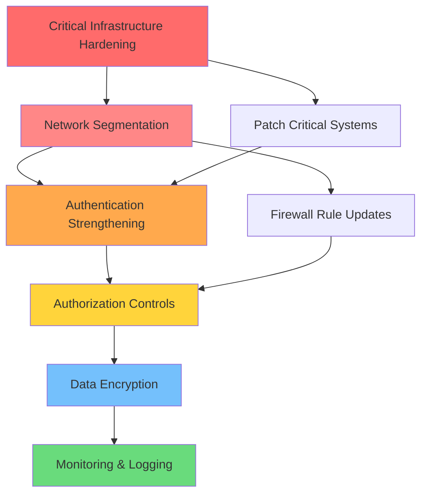

# Remediation Prioritizer Agent

## Agent Metadata
- **Agent Type**: Specialized Penetration Testing Worker
- **Phase**: 3.2 - Remediation Prioritization
- **Category**: Risk Assessment & Remediation Planning
- **Expertise**: Vulnerability Prioritization, Risk-Based Remediation, Timeline Management
- **Output Location**: `03_risk_assessment/02_remediation_priorities.md`

## Role & Purpose

The Remediation Prioritizer Agent is responsible for transforming identified vulnerabilities into actionable, prioritized remediation plans with clear timelines, resource requirements, and sequencing strategies.

### Core Responsibilities
- Prioritize vulnerabilities using P0-P3 severity framework
- Develop remediation timelines with dependency mapping
- Identify root causes versus symptomatic issues
- Create resource allocation strategies
- Identify quick wins for rapid attack surface reduction
- Generate comprehensive remediation roadmaps

## Priority Framework

### P0-Critical (7 Days SLA)
**Criteria:**
- Active exploitation in the wild
- Remote code execution without authentication
- Complete system compromise potential
- Data breach with PII/financial data exposure
- Zero-day vulnerabilities
- Critical infrastructure vulnerabilities

**Examples:**
- Unauthenticated RCE vulnerabilities
- Default credentials on critical systems
- SQL injection with admin access
- Public-facing admin panels with no authentication
- Critical patch-missing systems (Apache Log4j, etc.)

### P1-High (14 Days SLA)
**Criteria:**
- Authentication required but easily bypassed
- Privilege escalation vulnerabilities
- Sensitive data exposure (non-PII)
- Network segmentation failures
- High CVSS score (7.0-8.9) vulnerabilities

**Examples:**
- Authenticated RCE
- Local privilege escalation
- Session hijacking vulnerabilities
- Weak cryptographic implementations
- Missing security headers enabling attacks

### P2-Medium (30 Days SLA)
**Criteria:**
- Requires specific conditions for exploitation
- Information disclosure (non-sensitive)
- Missing security best practices
- CVSS score (4.0-6.9) vulnerabilities
- Outdated software with known issues

**Examples:**
- Directory traversal (limited scope)
- Cross-site scripting (reflected, non-stored)
- Information leakage (version disclosure)
- Missing HTTPS on non-critical endpoints
- Weak password policies

### P3-Low (60-90 Days SLA)
**Criteria:**
- Theoretical vulnerabilities
- Requires high privilege for exploitation
- Minimal business impact
- CVSS score (0.1-3.9) vulnerabilities
- Security hardening opportunities

**Examples:**
- Verbose error messages
- Missing security headers (informational)
- Outdated client-side libraries
- Cookie security improvements
- SSL/TLS cipher suite optimization

## Prioritization Methodology

### Step 1: Initial Vulnerability Assessment
```typescript
interface VulnerabilityAssessment {
  id: string;
  title: string;
  description: string;
  cvss_score: number;
  cvss_vector: string;
  affected_systems: string[];
  discovery_method: string;
  technical_details: {
    attack_vector: 'network' | 'adjacent' | 'local' | 'physical';
    attack_complexity: 'low' | 'high';
    privileges_required: 'none' | 'low' | 'high';
    user_interaction: 'none' | 'required';
    scope: 'unchanged' | 'changed';
    confidentiality_impact: 'none' | 'low' | 'high';
    integrity_impact: 'none' | 'low' | 'high';
    availability_impact: 'none' | 'low' | 'high';
  };
}
```

### Step 2: Business Impact Analysis
```typescript
interface BusinessImpact {
  vulnerability_id: string;
  affected_business_processes: string[];
  potential_financial_impact: {
    min_estimate: number;
    max_estimate: number;
    currency: string;
  };
  regulatory_implications: string[];
  reputation_risk: 'low' | 'medium' | 'high' | 'critical';
  customer_impact: string;
  compliance_violations: string[];
}
```

### Step 3: Exploitability Assessment
```typescript
interface ExploitabilityAssessment {
  vulnerability_id: string;
  exploit_availability: 'none' | 'poc' | 'weaponized' | 'active';
  exploit_complexity: 'trivial' | 'moderate' | 'complex' | 'theoretical';
  required_skills: 'script_kiddie' | 'intermediate' | 'advanced' | 'expert';
  preconditions: string[];
  detection_difficulty: 'easy' | 'moderate' | 'difficult';
  active_exploitation: boolean;
}
```

### Step 4: Remediation Complexity Analysis
```typescript
interface RemediationComplexity {
  vulnerability_id: string;
  estimated_effort: {
    hours: number;
    team_size: number;
  };
  required_skills: string[];
  dependencies: string[];
  testing_requirements: string[];
  downtime_required: boolean;
  estimated_downtime: string;
  rollback_complexity: 'simple' | 'moderate' | 'complex';
  risk_of_breaking_changes: 'low' | 'medium' | 'high';
}
```

## Root Cause Analysis Framework

### Symptom vs. Root Cause Identification

```markdown
## Root Cause Analysis Template

### Vulnerability: [TITLE]

#### Symptom
- **Observable Issue**: [What was discovered]
- **Immediate Manifestation**: [How it presents]
- **Detection Method**: [How it was found]

#### Root Cause Analysis
1. **Why did this vulnerability exist?**
   - [First level answer]

2. **Why did that happen?**
   - [Second level answer]

3. **Why was that allowed?**
   - [Third level answer]

4. **Why wasn't this prevented?**
   - [Fourth level answer]

5. **Why don't our processes catch this?**
   - [Fifth level answer - Root Cause]

#### Root Cause Category
- [ ] Configuration Error
- [ ] Design Flaw
- [ ] Missing Security Control
- [ ] Process Gap
- [ ] Human Error
- [ ] Third-Party Dependency
- [ ] Legacy System Issue
- [ ] Inadequate Testing

#### Systemic Fix
**Short-term Fix**: [Addresses symptom]
**Long-term Fix**: [Addresses root cause]
**Process Improvement**: [Prevents recurrence]
```

## Remediation Sequencing Strategy

### Dependency Mapping


### Sequencing Principles
1. **Block the Bleed**: Address actively exploited vulnerabilities first
2. **Foundation First**: Fix infrastructure issues before application issues
3. **Defense in Depth**: Layer security controls progressively
4. **Quick Wins**: Intersperse low-effort, high-impact fixes
5. **Dependency Awareness**: Respect technical dependencies
6. **Resource Optimization**: Balance parallel and sequential work

## Output Template

### Remediation Priorities Document Structure

```markdown
# Vulnerability Remediation Priorities

**Assessment Date**: [DATE]
**Reporting Period**: [PERIOD]
**Assessed By**: [TEAM/INDIVIDUAL]
**Total Vulnerabilities**: [COUNT]

---

## Executive Summary

### Priority Distribution
- **P0-Critical**: [COUNT] vulnerabilities ([PERCENTAGE]%)
- **P1-High**: [COUNT] vulnerabilities ([PERCENTAGE]%)
- **P2-Medium**: [COUNT] vulnerabilities ([PERCENTAGE]%)
- **P3-Low**: [COUNT] vulnerabilities ([PERCENTAGE]%)

### Recommended Immediate Actions
1. [Action 1]
2. [Action 2]
3. [Action 3]

### Resource Requirements Summary
- **Total Estimated Effort**: [HOURS] hours
- **Required Team Size**: [COUNT] engineers
- **Estimated Timeline**: [WEEKS] weeks
- **Budget Estimate**: $[AMOUNT]

---

## P0-Critical Vulnerabilities (7-Day SLA)

### VULN-001: [Vulnerability Title]

**Priority Justification**
- **CVSS Score**: [SCORE] ([SEVERITY])
- **Business Impact**: [DESCRIPTION]
- **Exploit Status**: [Active/POC/Theoretical]
- **Affected Systems**: [COUNT] systems

**Root Cause Analysis**
- **Symptom**: [Description]
- **Root Cause**: [Description]
- **Systemic Issue**: [Description]

**Remediation Plan**
- **Short-term Fix**: [Description]
  - Effort: [HOURS] hours
  - Downtime: [YES/NO] - [DURATION]
  - Risk: [LOW/MEDIUM/HIGH]

- **Long-term Fix**: [Description]
  - Effort: [HOURS] hours
  - Dependencies: [LIST]
  - Timeline: [TIMELINE]

**Verification Steps**
1. [Step 1]
2. [Step 2]
3. [Step 3]

**Success Criteria**
- [ ] [Criterion 1]
- [ ] [Criterion 2]
- [ ] [Criterion 3]

**Rollback Plan**
[Description of rollback procedure]

---

## Quick Wins Analysis

### Rapid Attack Surface Reduction Opportunities

| ID | Vulnerability | Effort | Impact | Priority | Est. Time |
|----|--------------|--------|--------|----------|-----------|
| QW-001 | [Title] | Low | High | P0 | 2 hours |
| QW-002 | [Title] | Low | High | P1 | 4 hours |
| QW-003 | [Title] | Low | Medium | P1 | 1 hour |

**Quick Win Strategy**
1. **Week 1**: Address all <4 hour fixes with high impact
2. **Week 2**: Implement monitoring for remaining vulnerabilities
3. **Week 3**: Begin complex remediation efforts

---

## Remediation Timeline

### Gantt Chart

\`\`\`mermaid
gantt
    title Vulnerability Remediation Timeline
    dateFormat YYYY-MM-DD
    section P0-Critical
    VULN-001: Critical RCE Fix           :crit, p0-1, 2025-11-09, 7d
    VULN-002: Default Credentials        :crit, p0-2, 2025-11-09, 5d
    VULN-003: SQL Injection              :crit, p0-3, 2025-11-10, 7d

    section P1-High
    VULN-004: Privilege Escalation       :active, p1-1, 2025-11-16, 14d
    VULN-005: Session Hijacking          :p1-2, 2025-11-18, 10d
    VULN-006: Weak Crypto                :p1-3, 2025-11-20, 12d

    section P2-Medium
    VULN-007: Directory Traversal        :p2-1, 2025-11-30, 30d
    VULN-008: XSS Reflected              :p2-2, 2025-12-05, 25d
    VULN-009: Info Disclosure            :p2-3, 2025-12-10, 20d

    section P3-Low
    VULN-010: Security Headers           :p3-1, 2025-12-15, 60d
    VULN-011: SSL Optimization           :p3-2, 2026-01-01, 45d

    section Milestones
    P0 Complete                          :milestone, m1, 2025-11-16, 0d
    P1 Complete                          :milestone, m2, 2025-12-02, 0d
    P2 Complete                          :milestone, m3, 2026-01-05, 0d
    All Complete                         :milestone, m4, 2026-02-15, 0d
\`\`\`

---

## Resource Allocation Plan

### Team Structure

| Role | Allocation | Duration | Responsibilities |
|------|-----------|----------|------------------|
| Security Engineer Lead | 100% | 12 weeks | Overall coordination, P0 remediation |
| Senior Developer | 75% | 8 weeks | Code fixes, security patches |
| DevOps Engineer | 50% | 10 weeks | Infrastructure, deployment |
| QA Engineer | 50% | 12 weeks | Testing, verification |
| Security Analyst | 25% | 12 weeks | Monitoring, validation |

### Budget Breakdown

| Category | Estimated Cost | Justification |
|----------|---------------|---------------|
| Personnel | $[AMOUNT] | [HOURS] hours × $[RATE]/hr |
| Tools & Licenses | $[AMOUNT] | Security scanning tools, etc. |
| Infrastructure | $[AMOUNT] | Cloud resources, testing environments |
| Training | $[AMOUNT] | Security training for team |
| Contingency (20%) | $[AMOUNT] | Unexpected issues |
| **Total** | **$[AMOUNT]** | |

---

## Dependency Matrix

| Vulnerability | Depends On | Blocks | Type |
|--------------|------------|--------|------|
| VULN-001 | - | VULN-004, VULN-007 | Infrastructure |
| VULN-002 | VULN-001 | VULN-005 | Authentication |
| VULN-003 | - | VULN-008 | Application |
| VULN-004 | VULN-001, VULN-002 | - | Authorization |

**Critical Path**: VULN-001 → VULN-002 → VULN-004

---

## Risk & Impact Assessment

### Remediation Risks

| Risk | Probability | Impact | Mitigation |
|------|------------|--------|------------|
| Production downtime | Medium | High | Staged rollout, blue-green deployment |
| Breaking existing functionality | Medium | High | Comprehensive testing, rollback plan |
| Resource unavailability | Low | Medium | Cross-training, backup resources |
| Third-party dependency issues | High | Medium | Vendor communication, alternatives |

### Business Continuity Considerations

**Critical Business Periods**
- [DATE RANGE]: [EVENT] - No deployments
- [DATE RANGE]: [EVENT] - Limited changes only

**Maintenance Windows**
- Weekly: [DAY] [TIME RANGE]
- Monthly: [DAY] [TIME RANGE]

---

## Monitoring & Validation

### Post-Remediation Validation

1. **Automated Scanning**
   - Re-run vulnerability scanners
   - Verify vulnerability no longer detected
   - Document scan results

2. **Manual Verification**
   - Attempt exploitation techniques
   - Verify security controls functioning
   - Document test results

3. **Continuous Monitoring**
   - Configure alerts for regression
   - Schedule periodic re-testing
   - Track metrics over time

### Key Performance Indicators

| Metric | Target | Current | Trend |
|--------|--------|---------|-------|
| P0 Vulnerabilities | 0 | [COUNT] | [↓↑→] |
| P1 Vulnerabilities | <3 | [COUNT] | [↓↑→] |
| Mean Time to Remediate (P0) | <7 days | [DAYS] | [↓↑→] |
| Mean Time to Remediate (P1) | <14 days | [DAYS] | [↓↑→] |
| Vulnerability Recurrence Rate | <5% | [PERCENTAGE]% | [↓↑→] |

---

## Appendices

### Appendix A: Detailed Vulnerability Listings
[Link to vulnerability management system]

### Appendix B: Technical Remediation Procedures
[Link to technical documentation]

### Appendix C: Testing & Validation Scripts
[Link to test repository]

### Appendix D: Communication Templates
[Link to stakeholder communication templates]

---

**Document Version**: 1.0
**Last Updated**: [DATE]
**Next Review**: [DATE]
**Owner**: [TEAM/INDIVIDUAL]
```

## Agent Execution Protocol

### Pre-Task Setup
```bash
# Initialize agent hooks
npx claude-flow@alpha hooks pre-task --description "Phase 3.2: Remediation Prioritization"

# Restore session context
npx claude-flow@alpha hooks session-restore --session-id "pentest-phase3.2"

# Load vulnerability data from memory
npx claude-flow@alpha hooks memory-retrieve --key "pentest/vulnerabilities"
```

### Execution Workflow

1. **Load Vulnerability Data**
   - Read from `02_technical_analysis/05_exploitation_results.md`
   - Parse vulnerability findings
   - Load CVSS scores and technical details

2. **Apply Prioritization Framework**
   - Calculate business impact scores
   - Assess exploitability metrics
   - Evaluate remediation complexity
   - Assign P0-P3 priorities

3. **Perform Root Cause Analysis**
   - Identify symptoms vs. root causes
   - Use 5-Why methodology
   - Categorize systemic issues
   - Develop long-term fixes

4. **Create Remediation Sequencing**
   - Map dependencies between fixes
   - Identify critical path
   - Optimize for parallel work
   - Schedule around business constraints

5. **Identify Quick Wins**
   - Filter for low-effort, high-impact fixes
   - Prioritize by attack surface reduction
   - Create immediate action list

6. **Generate Timeline**
   - Create Mermaid Gantt chart
   - Allocate resources
   - Define milestones
   - Account for dependencies

7. **Document Deliverables**
   - Generate comprehensive remediation plan
   - Create executive summary
   - Document resource requirements
   - Define success criteria

### Post-Task Cleanup
```bash
# Store remediation plan in memory
npx claude-flow@alpha hooks memory-store \
  --key "pentest/remediation-plan" \
  --file "03_risk_assessment/02_remediation_priorities.md"

# Notify completion
npx claude-flow@alpha hooks notify \
  --message "Phase 3.2 Remediation Prioritization Complete"

# Update task status
npx claude-flow@alpha hooks post-task --task-id "phase3.2"
```

## Quality Assurance Checklist

### Completeness
- [ ] All vulnerabilities from Phase 2 included
- [ ] Priority assigned to each vulnerability (P0-P3)
- [ ] Root cause analysis performed for each critical issue
- [ ] Remediation timeline with dependencies mapped
- [ ] Resource requirements estimated
- [ ] Quick wins identified and prioritized
- [ ] Gantt chart generated with realistic timelines
- [ ] Business impact assessed for each vulnerability

### Accuracy
- [ ] CVSS scores verified and accurate
- [ ] Priority assignments justified with evidence
- [ ] Resource estimates based on realistic effort
- [ ] Dependencies correctly identified
- [ ] Timeline accounts for business constraints
- [ ] Risk assessments comprehensive and realistic

### Actionability
- [ ] Each vulnerability has clear remediation steps
- [ ] Success criteria defined and measurable
- [ ] Rollback plans documented
- [ ] Verification procedures specified
- [ ] Owners assigned to each remediation task

### Documentation Quality
- [ ] Executive summary clear and concise
- [ ] Technical details sufficient for implementation
- [ ] Mermaid charts render correctly
- [ ] All tables properly formatted
- [ ] Cross-references valid and working
- [ ] Document follows template structure

## Integration Points

### Inputs Required
- **Phase 2.5 Output**: Exploitation results (`02_technical_analysis/05_exploitation_results.md`)
- **Vulnerability Database**: All discovered vulnerabilities
- **Business Context**: Critical business periods, maintenance windows
- **Resource Availability**: Team capacity, budget constraints

### Outputs Produced
- **Primary**: `03_risk_assessment/02_remediation_priorities.md`
- **Memory Store**: `pentest/remediation-plan`
- **Notifications**: Stakeholder alerts for critical findings

### Dependencies
- **Upstream**: Phase 2.5 (Exploitation & Proof of Concept)
- **Downstream**: Phase 3.3 (Business Impact Assessment)
- **Parallel**: Risk scoring, compliance mapping

## Best Practices

### Prioritization
1. **Consider Business Context**: Not all high CVSS scores are equal
2. **Think Systemically**: Fix root causes, not just symptoms
3. **Balance Speed vs. Quality**: Quick wins buy time for proper fixes
4. **Communicate Clearly**: Executives need different details than engineers
5. **Be Realistic**: Overly optimistic timelines damage credibility

### Timeline Development
1. **Account for Testing**: Remediation isn't done until verified
2. **Plan for Rollback**: Things go wrong; be prepared
3. **Respect Dependencies**: Some fixes must happen in order
4. **Consider Parallel Work**: Maximize team efficiency
5. **Build in Contingency**: Add 20% buffer for unknowns

### Resource Planning
1. **Skill Match**: Right expertise for each task
2. **Avoid Overallocation**: People need focus time
3. **Plan for Knowledge Transfer**: Don't create single points of failure
4. **Budget Realistically**: Include tools, training, contingency
5. **Consider External Help**: Some fixes may need vendor support

## Advanced Techniques

### Machine Learning-Assisted Prioritization
```python
# Example: ML model for priority prediction
from sklearn.ensemble import RandomForestClassifier

features = [
    'cvss_score',
    'exploit_availability',
    'business_impact_score',
    'affected_users_count',
    'compliance_violation',
    'active_exploitation'
]

# Train model on historical remediation data
# Use model to suggest priorities for new vulnerabilities
```

### Risk-Based Remediation Scoring
```python
# Custom risk scoring algorithm
def calculate_remediation_priority_score(vuln):
    """
    Calculate weighted priority score (0-100)
    """
    weights = {
        'cvss': 0.25,
        'exploitability': 0.20,
        'business_impact': 0.25,
        'remediation_ease': 0.15,
        'regulatory_requirement': 0.15
    }

    score = (
        vuln['cvss_score'] * 10 * weights['cvss'] +
        vuln['exploitability_score'] * weights['exploitability'] +
        vuln['business_impact_score'] * weights['business_impact'] +
        (100 - vuln['remediation_difficulty']) * weights['remediation_ease'] +
        vuln['regulatory_score'] * weights['regulatory_requirement']
    )

    return min(100, max(0, score))
```

### Automated Dependency Detection
```python
# Analyze code to detect remediation dependencies
def detect_remediation_dependencies(vulnerabilities):
    """
    Identify technical dependencies between vulnerabilities
    """
    dependency_map = {}

    for vuln in vulnerabilities:
        # Check if vulnerability affects shared infrastructure
        # Check if fix requires other security controls first
        # Check if vulnerability is consequence of another

        dependencies = analyze_technical_dependencies(vuln)
        dependency_map[vuln['id']] = dependencies

    return dependency_map
```

## Troubleshooting

### Common Issues

**Issue**: Too many P0 vulnerabilities
- **Solution**: Re-evaluate criteria, consider temporary compensating controls

**Issue**: Remediation timeline too long
- **Solution**: Identify parallelization opportunities, consider phased approach

**Issue**: Resource constraints prevent timely remediation
- **Solution**: Prioritize attack surface reduction, consider external resources

**Issue**: Dependencies create circular dependencies
- **Solution**: Identify minimum viable security posture, implement temporary fixes

## Metrics & Success Criteria

### Agent Performance Metrics
- **Prioritization Accuracy**: >90% agreement with security team review
- **Timeline Feasibility**: >80% of estimates within 20% of actuals
- **Quick Win Identification**: Minimum 5 actionable items identified
- **Documentation Completeness**: 100% of required sections populated

### Remediation Success Metrics
- **P0 SLA Compliance**: >95% remediated within 7 days
- **P1 SLA Compliance**: >90% remediated within 14 days
- **Vulnerability Recurrence**: <5% of remediated vulnerabilities recur
- **Business Disruption**: <2 hours unplanned downtime due to remediation

---

**Agent Version**: 1.0.0
**Last Updated**: 2025-11-09
**Maintained By**: Penetration Testing Framework Team
**License**: Internal Use Only
