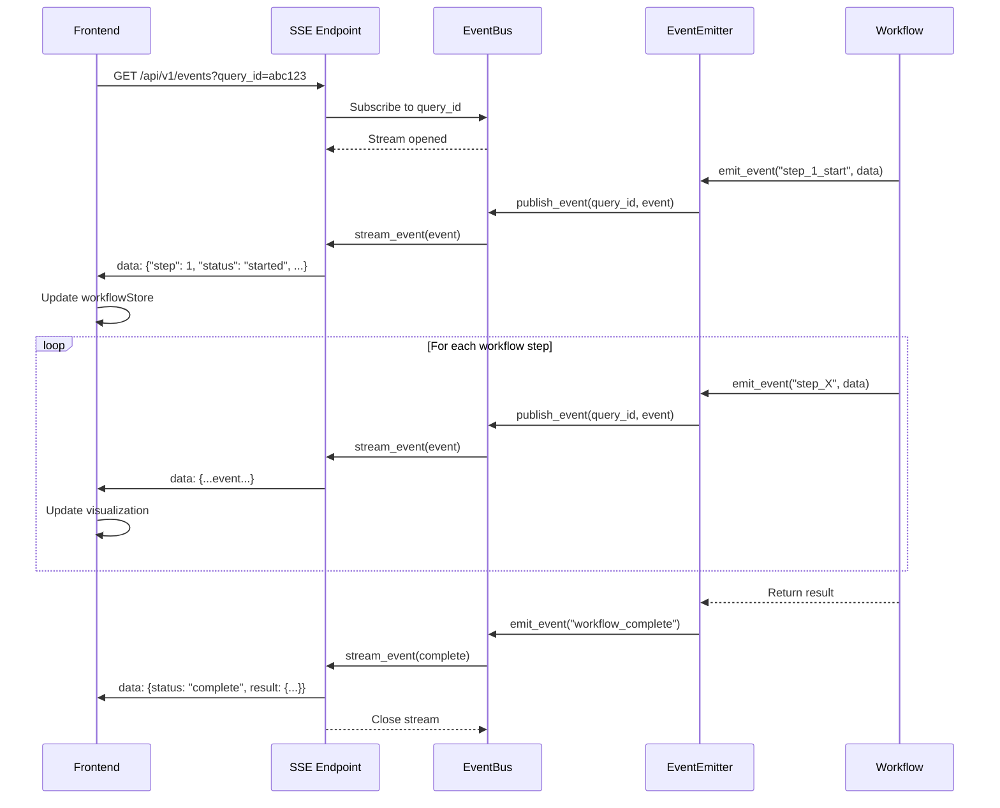

# Frontend-API Integration Mapping

**Last Updated**: 2025-11-10
**Architecture**: 6-Layer Full-Stack System

---

## System Architecture Overview

```
┌─────────────────────────────────────────────────────┐
│  Layer 6: Frontend (React + TypeScript)             │
│  - 8 visualization components (65KB)                │
│  - SSE event streaming                              │
│  - Zustand state management                         │
└──────────────────┬──────────────────────────────────┘
                   │ HTTP + SSE
┌──────────────────▼──────────────────────────────────┐
│  Layer 5: API (FastAPI)                             │
│  - NCRSAdapter (async/sync bridge)                  │
│  - EventBus (real-time events)                      │
│  - SSE streaming (1,027 lines)                      │
└──────────────────┬──────────────────────────────────┘
                   │ Python API
┌──────────────────▼──────────────────────────────────┐
│  Layer 4: Facade (Orchestration)                    │
│  - facade_workflow.py (554 lines)                   │
│  - execute_query_workflow() - main entry            │
│  - Performance tracking & metrics                   │
└──────────────────┬──────────────────────────────────┘
                   │
        ┌──────────┴──────────┐
        ▼                     ▼
┌───────────────┐     ┌───────────────┐
│ Layer 3:      │     │ External      │
│ Workflow      │     │ Services      │
│ Steps (8)     │     │ - Qwen RPC    │
│ - 262 files   │     │ - ConceptNet  │
└───────────────┘     └───────────────┘
```

---

## API Endpoints

### REST API Endpoints
```
POST /api/v1/query              # Submit query, start workflow
GET  /api/v1/events             # SSE event stream (real-time updates)
GET  /api/v1/health             # Health check (assumed)
GET  /api/v1/schemas            # Schema information (assumed)
```

### Query Submission Flow

#### 1. Frontend → API: Submit Query
```typescript
// Frontend: NCRSQueryPage.tsx
const response = await fetch('/api/v1/query', {
  method: 'POST',
  headers: { 'Content-Type': 'application/json' },
  body: JSON.stringify({
    query: "What causes traffic accidents?",
    max_seeds: 50,
    max_workers: 8
  })
});

const { query_id, status } = await response.json();
// Returns: { query_id: "abc123", status: "processing" }
```

#### 2. API → Backend: Execute Query
```python
# API: src/api/routes/query.py
@router.post("/query")
async def submit_query(request: QueryRequest):
    adapter = NCRSAdapter()
    query_id = await adapter.query_async(
        query=request.query,
        max_seeds=request.max_seeds,
        max_workers=request.max_workers
    )
    return {"query_id": query_id, "status": "processing"}
```

#### 3. NCRSAdapter → Facade: Workflow Execution
```python
# API: src/api/app/ncrs_adapter.py
class NCRSAdapter:
    async def query_async(self, query: str, **kwargs):
        # Async/sync bridge
        loop = asyncio.get_event_loop()
        result = await loop.run_in_executor(
            None,
            self._execute_sync,
            query,
            kwargs
        )
        return result

    def _execute_sync(self, query: str, kwargs: dict):
        from ncrs.facade_workflow import execute_query_workflow

        # Emit events during workflow
        with EventEmitter(query_id=self.query_id) as emitter:
            result = execute_query_workflow(
                query=query,
                event_emitter=emitter,  # Hook for SSE events
                **kwargs
            )
        return result
```

---

## Server-Sent Events (SSE) Streaming

### Event Flow Architecture



### Frontend: SSE Connection

#### useSSE Hook
```typescript
// Frontend: src/web/src/hooks/useSSE.ts
export function useSSE(queryId: string) {
  useEffect(() => {
    const eventSource = new EventSource(
      `/api/v1/events?query_id=${queryId}`
    );

    eventSource.onmessage = (event) => {
      const data = JSON.parse(event.data);

      // Update Zustand store
      workflowStore.updateStep(data.step, data);

      // Trigger visualization updates
      visualizationStore.addEvent(data);
    };

    eventSource.onerror = () => {
      eventSource.close();
      // Retry logic in useSSEWithRetry.ts
    };

    return () => eventSource.close();
  }, [queryId]);
}
```

#### Enhanced Streaming Hook
```typescript
// Frontend: src/web/src/hooks/useWorkflowStreamEnhanced.ts
export function useWorkflowStreamEnhanced(queryId: string) {
  const [events, setEvents] = useState<WorkflowEvent[]>([]);
  const [currentStep, setCurrentStep] = useState<number>(0);
  const [isComplete, setIsComplete] = useState<boolean>(false);

  useSSE(queryId, {
    onEvent: (event) => {
      setEvents(prev => [...prev, event]);
      setCurrentStep(event.step);

      if (event.status === 'complete') {
        setIsComplete(true);
      }
    }
  });

  return { events, currentStep, isComplete };
}
```

### API: SSE Endpoint

#### SSE Route
```python
# API: src/api/routes/events.py (228 lines)
from sse_starlette.sse import EventSourceResponse

@router.get("/events")
async def stream_events(query_id: str):
    """Stream workflow events via Server-Sent Events"""

    async def event_generator():
        # Subscribe to EventBus for this query_id
        queue = event_bus.subscribe(query_id)

        try:
            while True:
                # Wait for next event
                event = await queue.get()

                # Format SSE event
                yield {
                    "event": event.type,
                    "data": json.dumps(event.data),
                    "id": event.id
                }

                # Close stream if workflow complete
                if event.type == "workflow_complete":
                    break
        finally:
            event_bus.unsubscribe(query_id)

    return EventSourceResponse(event_generator())
```

#### EventBus Implementation
```python
# API: src/api/app/event_bus.py (335 lines)
from asyncio import Queue
from typing import Dict

class EventBus:
    def __init__(self):
        self.subscribers: Dict[str, Queue] = {}

    def subscribe(self, query_id: str) -> Queue:
        """Subscribe to events for a specific query"""
        queue = Queue()
        self.subscribers[query_id] = queue
        return queue

    def unsubscribe(self, query_id: str):
        """Unsubscribe from events"""
        self.subscribers.pop(query_id, None)

    async def publish_event(self, query_id: str, event: Event):
        """Publish event to all subscribers of this query"""
        if query_id in self.subscribers:
            await self.subscribers[query_id].put(event)

# Global singleton
event_bus = EventBus()
```

#### EventEmitter Integration
```python
# API: src/api/utils/event_emitter.py (464 lines)
class EventEmitter:
    def __init__(self, query_id: str):
        self.query_id = query_id
        self.event_bus = event_bus

    def emit_event(self, event_type: str, data: dict):
        """Emit event to EventBus"""
        event = Event(
            type=event_type,
            data={
                "step": self._extract_step(event_type),
                "query_id": self.query_id,
                "timestamp": time.time(),
                **data
            }
        )

        # Publish to EventBus (async)
        asyncio.create_task(
            self.event_bus.publish_event(self.query_id, event)
        )

    def _extract_step(self, event_type: str) -> int:
        """Extract step number from event type"""
        # e.g., "step_1_start" -> 1
        if "step_" in event_type:
            return int(event_type.split("_")[1])
        return 0
```

---

## Frontend State Management (Zustand)

### Workflow Store
```typescript
// Frontend: src/web/src/stores/workflowStore.ts
interface WorkflowState {
  queryId: string | null;
  currentStep: number;
  steps: Record<number, StepData>;
  isComplete: boolean;
  result: any | null;
}

const useWorkflowStore = create<WorkflowState>((set) => ({
  queryId: null,
  currentStep: 0,
  steps: {},
  isComplete: false,
  result: null,

  // Actions
  setQueryId: (id: string) => set({ queryId: id }),

  updateStep: (step: number, data: StepData) =>
    set((state) => ({
      steps: { ...state.steps, [step]: data },
      currentStep: step
    })),

  setComplete: (result: any) =>
    set({ isComplete: true, result })
}));
```

### Visualization Store
```typescript
// Frontend: src/web/src/stores/visualizationStore.ts
interface VisualizationState {
  events: WorkflowEvent[];
  selectedPath: string | null;
  filterConfig: FilterConfig;
}

const useVisualizationStore = create<VisualizationState>((set) => ({
  events: [],
  selectedPath: null,
  filterConfig: {},

  addEvent: (event: WorkflowEvent) =>
    set((state) => ({
      events: [...state.events, event]
    })),

  setSelectedPath: (pathId: string) =>
    set({ selectedPath: pathId })
}));
```

### Hop Store
```typescript
// Frontend: src/web/src/stores/hopStore.ts
interface HopState {
  currentHop: number;
  paths: Record<string, PathData>;
  terminatedPaths: string[];
}

const useHopStore = create<HopState>((set) => ({
  currentHop: 0,
  paths: {},
  terminatedPaths: [],

  updateHop: (hop: number) => set({ currentHop: hop }),

  addPath: (pathId: string, data: PathData) =>
    set((state) => ({
      paths: { ...state.paths, [pathId]: data }
    })),

  terminatePath: (pathId: string) =>
    set((state) => ({
      terminatedPaths: [...state.terminatedPaths, pathId]
    }))
}));
```

---

## Workflow Step Visualization Mapping

### 8 Step Visualizations

| Step | Backend Component | SSE Event | Frontend Component | Store | Size |
|------|------------------|-----------|-------------------|-------|------|
| **1** | `classification/llm_query_classifier.py` | `step_1_start`, `step_1_complete` | `ClassificationDetail.tsx` | workflowStore | 6,795 bytes |
| **2** | `goal_region/hyde_ensemble.py` | `step_2_start`, `step_2_complete` | `HyDeGoalDetail.tsx` | workflowStore | 6,814 bytes |
| **3** | `seed_extraction/extraction_orchestrator.py` | `step_3_start`, `step_3_complete` | `SeedExtractionDetail.tsx` | workflowStore | 8,313 bytes |
| **4** | `multi_path_controller/stage_seed_initialization.py` | `step_4_start`, `step_4_complete` | `MultiHopInitDetail.tsx` | hopStore | 6,880 bytes |
| **5** | `multi_path_controller/stage_multihop_loop.py` | `step_5_hop`, `step_5_path_update` | `MultiHopProgressDetail.tsx` | hopStore | 12,563 bytes |
| **6** | `multi_path_controller/stage_ranking.py` | `step_6_ranking` | `PathRankingDetail.tsx` | visualizationStore | 10,010 bytes |
| **7** | `multi_path_controller/stage_path_persistence.py` | `step_7_persistence` | `PathPersistenceDetail.tsx` | visualizationStore | 6,685 bytes |
| **8** | `synthesis/answer_synthesizer.py` | `step_8_start`, `step_8_complete` | `PathTerminationDetail.tsx` | workflowStore | 7,266 bytes |

**Total**: 65,326 bytes of frontend visualization code

### Event Types Per Step

#### Step 1: Classification
```typescript
{
  event: "step_1_start",
  data: {
    step: 1,
    query: "What causes traffic accidents?",
    timestamp: 1699999999
  }
}

{
  event: "step_1_complete",
  data: {
    step: 1,
    query_type: "CAUSAL",
    confidence: 0.92,
    column_weights: { ... }
  }
}
```

#### Step 2: HyDe Goal Generation
```typescript
{
  event: "step_2_start",
  data: {
    step: 2,
    query_type: "CAUSAL"
  }
}

{
  event: "step_2_complete",
  data: {
    step: 2,
    goal_embedding: [0.12, -0.34, ...],  // 384D vector
    hypotheses: ["Traffic accidents are caused by...", ...],
    fallback_used: false
  }
}
```

#### Step 3: Seed Extraction
```typescript
{
  event: "step_3_start",
  data: {
    step: 3,
    goal_embedding_ready: true
  }
}

{
  event: "step_3_complete",
  data: {
    step: 3,
    seed_concepts: [
      "distraction",
      "speeding",
      ...
    ],
    num_seeds: 50,
    goldilocks_threshold: 0.4
  }
}
```

#### Step 5: Multi-Hop Progress (Real-time)
```typescript
{
  event: "step_5_hop",
  data: {
    step: 5,
    hop: 3,
    path_id: "path_001",
    current_concept: "reckless_driving",
    goal_distance: 0.456,
    winners: [
      { concept: "speed", score: 0.89 },
      ...
    ]
  }
}

{
  event: "step_5_path_update",
  data: {
    step: 5,
    path_id: "path_001",
    status: "terminated",
    reason: "no_closer_candidates",
    total_hops: 5
  }
}
```

---

## Component Integration Details

### NCRSQueryPage (Main Entry)
```typescript
// Frontend: src/web/src/pages/NCRSQueryPage.tsx
export function NCRSQueryPage() {
  const [queryId, setQueryId] = useState<string | null>(null);
  const workflowState = useWorkflowStore();

  const handleSubmit = async (query: string) => {
    // Submit query to API
    const response = await fetch('/api/v1/query', {
      method: 'POST',
      body: JSON.stringify({ query })
    });

    const { query_id } = await response.json();
    setQueryId(query_id);
    workflowState.setQueryId(query_id);
  };

  return (
    <div>
      <QueryInput onSubmit={handleSubmit} />

      {queryId && (
        <>
          <WorkflowProgressTracker queryId={queryId} />
          <VisualizationTabs queryId={queryId} />
        </>
      )}
    </div>
  );
}
```

### WorkflowProgressTracker
```typescript
// Frontend: src/web/src/components/workflow/WorkflowProgressTracker.tsx
export function WorkflowProgressTracker({ queryId }: { queryId: string }) {
  const { currentStep, steps } = useWorkflowStore();
  const { events } = useWorkflowStreamEnhanced(queryId);

  return (
    <div className="workflow-progress">
      {[1, 2, 3, 4, 5, 6, 7, 8].map(step => (
        <StepIndicator
          key={step}
          step={step}
          status={steps[step]?.status || 'pending'}
          isCurrent={step === currentStep}
        />
      ))}
    </div>
  );
}
```

### VisualizationTabs (Dynamic Step Display)
```typescript
// Frontend: src/web/src/components/visualizations/VisualizationTabs.tsx
export function VisualizationTabs({ queryId }: { queryId: string }) {
  const { currentStep, steps } = useWorkflowStore();

  const renderStepVisualization = (step: number) => {
    switch (step) {
      case 1: return <ClassificationDetail data={steps[1]} />;
      case 2: return <HyDeGoalDetail data={steps[2]} />;
      case 3: return <SeedExtractionDetail data={steps[3]} />;
      case 4: return <MultiHopInitDetail data={steps[4]} />;
      case 5: return <MultiHopProgressDetail data={steps[5]} />;
      case 6: return <PathRankingDetail data={steps[6]} />;
      case 7: return <PathPersistenceDetail data={steps[7]} />;
      case 8: return <PathTerminationDetail data={steps[8]} />;
      default: return null;
    }
  };

  return (
    <Tabs selectedIndex={currentStep - 1}>
      {[1, 2, 3, 4, 5, 6, 7, 8].map(step => (
        <Tab key={step}>Step {step}</Tab>
      ))}

      <TabPanels>
        {[1, 2, 3, 4, 5, 6, 7, 8].map(step => (
          <TabPanel key={step}>
            {renderStepVisualization(step)}
          </TabPanel>
        ))}
      </TabPanels>
    </Tabs>
  );
}
```

---

## Data Flow Summary

### Query Submission → Result

```
1. User types query in NCRSQueryPage
     ↓
2. POST /api/v1/query → query_id returned
     ↓
3. Frontend opens SSE connection: GET /api/v1/events?query_id=abc123
     ↓
4. NCRSAdapter executes workflow (8 steps)
     ↓
5. EventEmitter emits events for each step
     ↓
6. EventBus publishes to SSE stream
     ↓
7. Frontend receives events, updates Zustand stores
     ↓
8. Visualization components re-render with new data
     ↓
9. Final result displayed in PathTerminationDetail
```

### Event Flow Timeline (Typical Query)

```
t=0ms    : User submits query
t=10ms   : POST /api/v1/query returns query_id
t=20ms   : SSE connection opened
t=50ms   : Event: step_1_start (Classification)
t=102ms  : Event: step_1_complete (QueryType: CAUSAL)
t=102ms  : Event: step_2_start (HyDe)
t=345ms  : Event: step_2_complete (Goal embedding)
t=345ms  : Event: step_3_start (Seed extraction)
t=443ms  : Event: step_3_complete (50 seeds)
t=444ms  : Event: step_4_start (Goal region)
t=445ms  : Event: step_4_complete
t=445ms  : Event: step_5_start (Multi-path SNN)
t=500ms  : Event: step_5_hop (hop 1, path_001)
t=550ms  : Event: step_5_hop (hop 2, path_001)
...
t=1,679ms: Event: step_5_path_update (path_001 terminated)
t=1,680ms: Event: step_6_start (Regression filter)
t=1,681ms: Event: step_6_complete
t=1,681ms: Event: step_7_start (Path persistence)
t=1,686ms: Event: step_7_complete (JSONL written)
t=1,686ms: Event: step_8_start (Synthesis)
t=1,887ms: Event: step_8_complete (Answer generated)
t=1,892ms: Event: workflow_complete (Final result)
```

---

**Last Verified**: 2025-11-10
**Integration Status**: ✅ Complete, real-time SSE streaming operational
**Frontend Components**: 8 visualization components (65KB)
**API Layer**: FastAPI + EventBus + SSE (1,027 lines)
